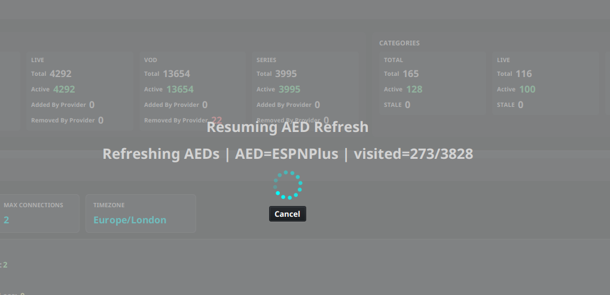
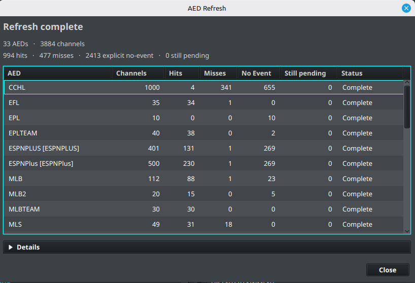

# Manage and Refresh AEDs

PRO [See Free vs Pro](../getting-started/free-vs-pro.md).

Use [Dummy Guide Inventory](../setup/dummy-guides.md) to find definitions and check where they are used. For setup concepts, see [Advanced EPG Dummies](aed.md); for field syntax, see [AED Templates and Regex](aed-reference.md).

## Test and refresh an AED

1. Open the AED tester from the AED workflow.
2. Paste representative provider channel names, including a channel with no active event.
3. Confirm the regex captures map to the intended placeholders.
4. Check the generated name, description, and logo URL.
5. Save the AED only after the results are correct.
6. Refresh the assigned AED channels and inspect the result in the Layout Editor.

After a successful playlist source sync, eligible sports channels that previously had no match are retried automatically. If a channel still has no event, confirm that the sports data is available, the AED is assigned, and the provider name or custom lookup name matches the AED rules before using **Refresh AEDs** manually.

### Refresh AED results

Use **Sources** → **AED Refresh…** when you need to refresh AED results beyond the currently selected group. Choose one of the following actions:

- **Refresh All** checks all configured AED channels and recalculates their current results.
- **Refresh Pending** continues queued AED work left by an earlier interrupted, paused, or incomplete refresh. It does not replace a full refresh for channels that were never queued.

The **Refresh AEDs** button in the Layout Editor still refreshes the AED channels in the selected group. A refresh can run in the background while the progress overlay shows the current AED and the number of visited channels. Select **Cancel** to request a pause; IPTVBoss finishes the current request before stopping. Start **AED Refresh…** → **Refresh Pending** later to continue queued work.

When the refresh finishes, the **AED Refresh** summary shows totals for AEDs and channels, plus **hits**, **misses**, **explicit no-event**, and **still pending** work. The table breaks those metrics down for each AED and includes the refresh **Status**. Expand **Details** for failed, discarded, superseded, and not-processed counts. A non-zero **still pending** value means that queued work remains and should be handled with **Refresh Pending** or another full refresh, as appropriate.

Include examples from different leagues, event states, and provider naming variations. A pattern that works for one event may silently produce empty placeholders for another.

## Related tools

### AI Regex Suggestions

**AI Regex Suggestions** can examine representative channel names and suggest values for the fields most likely to vary by provider, including Title Regex, Date Regex, Time Regex, Date Format, Time Format, and Source Timezone.

To use it, select representative channels, add samples from the source, generate suggestions, and review each suggested value before applying it. Include multiple naming variations when possible. AI-generated regex is a starting point, not a guarantee that every channel will match. Test the applied AED in the tester and inspect the generated event before assigning it broadly.

AI Regex Suggestions requires a configured AI provider and model. See [AI Settings](../settings/ai.md) for provider setup and troubleshooting.

### AED Bulk Updater

**AED Bulk Updater** applies selected field changes to several AEDs at once. Select the AEDs to update, enable only the fields that should change, enter or choose the new values, and apply the update. It can be used for shared extraction settings such as regex and formats, output timing settings, matching rules, logos, and enabled-state options.

Use it when several AEDs need the same correction, such as a provider changing from 12-hour to 24-hour times or a timezone setting changing. Review the selected AEDs and enabled fields carefully: any selected field can replace the existing value on every chosen AED. Test representative AEDs after a bulk update and refresh their assigned channels when the results are correct.

Other AED tools include:

- **AED Defaults** stores reusable output and matching defaults.
- **Import AED(s)** and **Export AED(s)** move AED definitions between installations.
- **Reload Sports Data** refreshes the sports data used by sports AED workflows.
- **Reload TXT Channel Names** reloads text-based channel names when that source workflow is in use.
- **AED Refresh…** opens the refresh choices for all configured AED channels or queued work that can be resumed.

AED tools may depend on the account plan and application release. If a menu item is locked, check account access before troubleshooting the definition.
