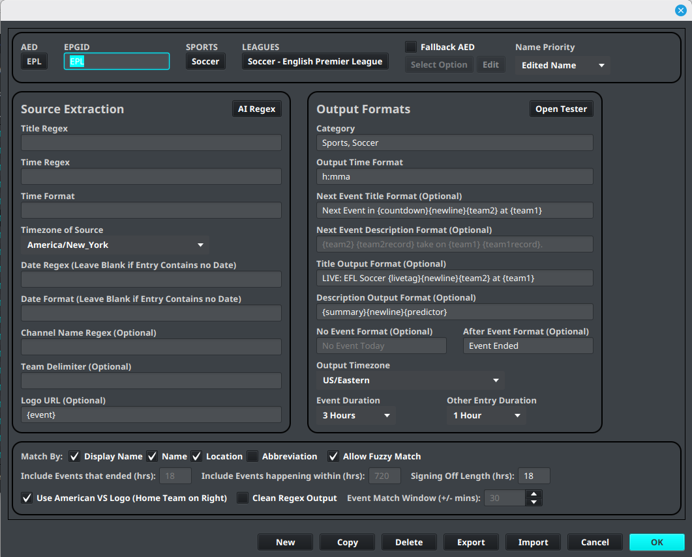
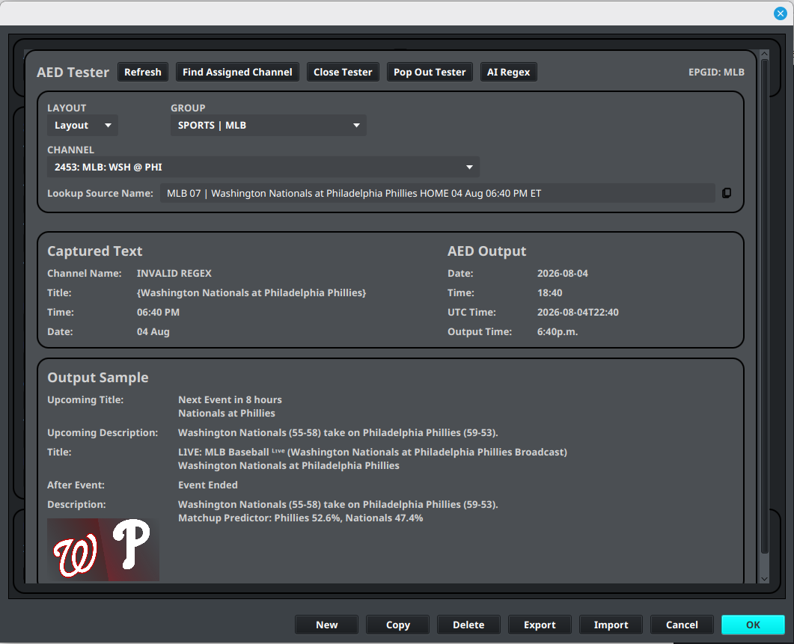
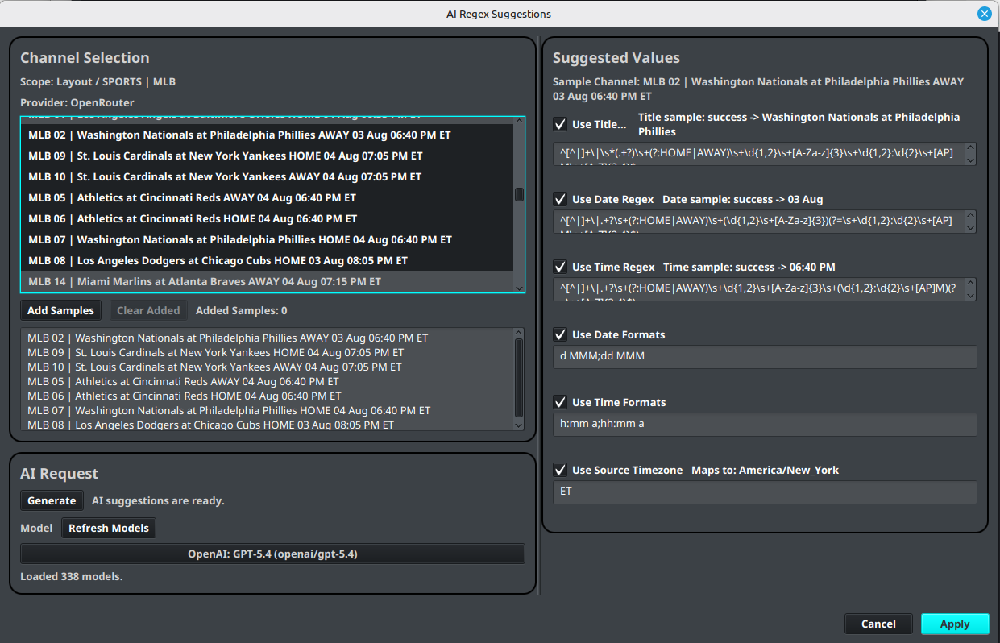
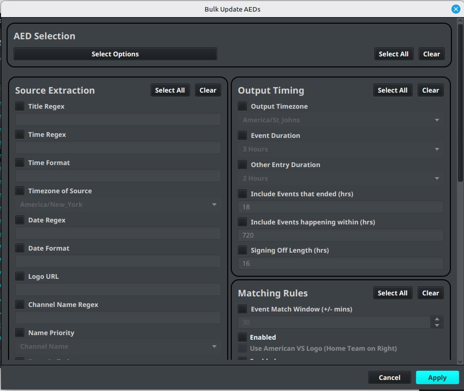
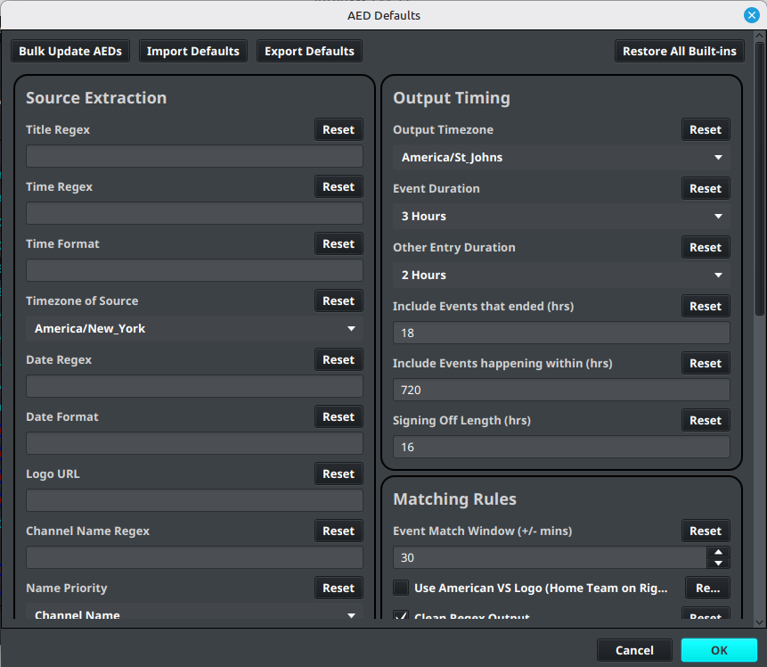

# Advanced EPG Dummies

💲 [Pro feature — see Free vs Pro](../getting-started/free-vs-pro.md).

Advanced EPG Dummies (AEDs) turn a channel name into an event-aware channel. An AED can identify the event, extract useful values from the provider name, format the output name and description, and select a suitable logo.

AEDs are especially useful for sports channels whose event names change throughout the day. They can also be used for other provider channels that follow a predictable naming pattern.

!!! warning
    AED results depend on the source naming pattern and the available event data. Test an AED against several real channel names before applying it to a large group.

## Open the AED editor

1. Open the **Sources** menu.
2. Select **AED Editor**.
3. Choose an existing AED or create a new definition.
4. Configure the matching, output, and logo fields.
5. Use the tester before saving or refreshing assigned channels.

The related **AED Bulk Updater** can apply a change to multiple existing AEDs. Import and export tools are available from the same Sources menu where supported by the account and release.



## League Based and Regex Based AEDs

AEDs can be used in two main ways. Choose the approach that matches the data available from your EPG source.

| AED approach | How it works | Best suited for |
| --- | --- | --- |
| **League Based** | Matches a channel to sports and league event data, then uses the matching event to populate teams, league, venue, time, logos, and other placeholders. | Sports channels whose names identify a league or sport and whose events are available in the sports data. |
| **Regex Based** | Reads the provider channel name and uses regular expressions to extract the title, date, time, or other values. | Non-sports channels, custom event feeds, or providers whose event details are not available in the sports data. |

League Based AEDs can also use regex. **Title Regex** can provide additional `{title}` fields, while **Date Regex** and **Time Regex** can extract event dates and times from provider names. Supplying date and time regex is recommended when those values are present in the channel name because it can speed up AED event matching and processing.

Regex Based AEDs do not need a league match to create an output channel name. They rely on the provider naming pattern, so similar channel names and representative test samples are especially important.

## How an AED is evaluated

The exact steps depend on the AED approach, but an AED normally combines three jobs:

1. **Match the provider channel.** A League Based AED uses its sport and league settings; a Regex Based AED uses Channel Name Regex.
2. **Extract event values.** Sports event data and regex fields populate placeholders such as `{title}`, `{team1}`, and `{league}`.
3. **Format the result.** Output fields use placeholders to produce the channel name, event title, description, and logo URL.

If no event is active, the channel can fall back to its provider name or to the AED's no-event behavior, depending on the configuration.

## Output placeholders

Use these placeholders in AED output fields. A value may be empty when the source or event does not provide it.

| Placeholder | Meaning |
| --- | --- |
| `{title}` | Full event title and the first title-regex capture group |
| `{title2}`–`{title10}` | Additional title-regex capture groups |
| `{team1}`, `{team2}` | Home and away team names |
| `{team1short}`, `{team2short}` | Short home and away team names |
| `{team1abbr}`, `{team2abbr}` | Team abbreviations |
| `{team1record}`, `{team2record}` | Team records, such as `12-3` |
| `{team1nick}`, `{team2nick}` | Team nicknames or mascots |
| `{team1loc}`, `{team2loc}` | Team city or location |
| `{league}` | Full league name |
| `{leagueabbr}` | League abbreviation |
| `{leagueshort}` | Short league name |
| `{arena}`, `{city}`, `{state}` | Venue and location information |
| `{time}` | Event start time |
| `{countdown}` | Countdown such as `5 hours 30 minutes` |
| `{Countdown}` | Sentence-case countdown |
| `{livetag}` | Live-event indicator tag |
| `{newline}` | A line break in output text |
| `{summary}` | AI-generated event preview, when available |
| `{predictor}` | Matchup prediction, when available |
| `{oddsml}` | Moneyline odds, when available |

`{title1}` is an alias for `{title}`. In Sports AEDs and Title Regex, `{title}` is the event title, so additional regex groups begin at `{title2}`. In a Simple Regex Dummy, capture group 1 maps to `{title}` and group 2 maps to `{title2}`.

## Conditional output

Use an `if` block to hide text when one of its placeholders has no value:

```text
{if - {title2}endif}
```

This is useful for an optional subtitle. To add punctuation only when the value exists, include it inside the conditional, for example:

```text
{if({title2})endif}
```

!!! warning
    Do not put `{newline}` inside an `{if}` block. It can cause the entire block to be ignored.

Use an `or` block to select the first branch that has a value:

```text
{livetag} {or{team1} at {team2}{||}{title}endor}
```

This produces a team matchup when team values exist and falls back to the event title otherwise. Nested `{or}` and `{if}` blocks can handle sports matchups, titled events with subtitles, and title-only events in one template.

## Sports logos

In the AED Logo field for Sports EPGs, use these placeholders to select a supplied sports graphic:

| Placeholder | Selects |
| --- | --- |
| `{logo}` | Universal choice; automatically selects a team or event logo |
| `{event}` | A matchup graphic for the two teams |
| `{team}` | A single team badge |
| `{league}` | A league logo |
| `{sport}` | A sport-level logo |

Use `{logo}` when you do not need to distinguish between team and matchup artwork.

For bulk logo assignment, numbered placeholders expand sequentially:

| Placeholder | Sequence |
| --- | --- |
| `{num1}` | `001`, `002`, `003` |
| `{nu1}` | `01`, `02`, `03` |
| `{n1}` | `1`, `2`, `3` |

For example:

```text
https://cdn.iptvboss.pro/logos/USA/ESPN+{num1}.v.png
```

Select the channels in a group, open the bulk logo editor, and paste a URL containing the numbered placeholder. IPTVBoss assigns the next number to each selected channel.

## Regex fields

### Channel Name Regex

Channel Name Regex controls which provider channels match the AED and can also create a clean output name.

- `{time}` and `{countdown}` are not supported in this field.
- `{league}` and `{leagueabbr}` need another placeholder alongside them; do not use either one by itself.
- When no event is active, the provider channel name is used as the fallback.

Examples:

```text
{leagueabbr}: {title}
```

This can produce:

```text
NHL: Detroit Red Wings at Chicago Blackhawks
```

If the AED is used for one league only, a fixed prefix is also possible:

```text
NHL: {title}
```

To keep only the provider prefix from a replay channel, this pattern matches the text through `NFL`:

```text
^(.*?\|\s*NFL)
```

### Title Regex

Each capture group in Title Regex maps to a title placeholder: the first group is `{title}`, the second is `{title2}`, and so on.

For a pipe-delimited provider name such as:

```text
Channel: AU (STAN 12) | Nice v Roma _ UEFA Europa League 2025/2026 (2025-09-25 04:55:43)
```

this pattern extracts the matchup and competition:

```regex
^[^\|]*\|\s*([^_]+?)\s*_\s*([^()]+?)\s*\(
```

The captures are `{title} = Nice v Roma` and `{title2} = UEFA Europa League 2025/2026`.

When a provider may omit one of its delimiters, a lookahead-based pattern can be more tolerant:

```regex
(?:.*?\|\s*)(.*?)(?=\s*[_\(])|(?:.*?\_\s*)(.*?)(?=\s*[_\/\(])
```

For FloSports-style names, separate patterns can extract the event and sport portions:

```regex
:\s*\d{4}\s+(.*?)\s*-
-\s*(.*?)\s*-\s*\d{2}/\d{2}
```

### Time Regex

For times written with AM or PM, this pattern matches values such as `8pm`, `8:30pm`, and `8:30PM`:

```regex
\s\d+[:\d+]*[Aa|Pp][M|m]
```

!!! warning
    Alternation such as `regex1|regex2` can populate only one side's capture groups. Prefer named groups or separate patterns when both formats must return values.

## Time and date formats

Date and time settings tell the AED how to interpret values captured from a provider channel name. The regex finds the value; the corresponding format tells IPTVBoss what that value means.

- **Time Regex** identifies the time in the provider name.
- **Time Format** describes the captured time, including whether it uses a 12-hour or 24-hour clock and whether it includes minutes or an AM/PM marker.
- **Date Regex** identifies the date in the provider name.
- **Date Format** describes the captured date, including the order of the day, month, and year.
- **Timezone of Source** identifies the timezone represented by the provider’s date and time.
- **Output Time Format** and **Output Timezone** control how the event time is shown in the generated output.

For example, a channel containing `03 Aug 06:40 PM` could use a date format such as `d MMM` and a time format such as `h:mm a`. A provider using a 24-hour value such as `18:40` needs a matching 24-hour time format. The format must match the provider text exactly; changing the format without changing the source pattern can prevent the event from matching.

Use the AED tester with samples from different days, times, and naming variations. Check the source timezone as well as the output timezone when an event appears at the wrong time.

## Test and refresh an AED

1. Open the AED tester from the AED workflow.
2. Paste representative provider channel names, including a channel with no active event.
3. Confirm the regex captures map to the intended placeholders.
4. Check the generated name, description, and logo URL.
5. Save the AED only after the results are correct.
6. Refresh the assigned AED channels and inspect the result in the Layout Editor.



Include examples from different leagues, event states, and provider naming variations. A pattern that works for one event may silently produce empty placeholders for another.

## Related tools

### AI Regex Suggestions



**AI Regex Suggestions** can examine representative channel names and suggest values for the fields most likely to vary by provider, including Title Regex, Date Regex, Time Regex, Date Format, Time Format, and Source Timezone.

To use it, select representative channels, add samples from the source, generate suggestions, and review each suggested value before applying it. Include multiple naming variations when possible. AI-generated regex is a starting point, not a guarantee that every channel will match. Test the applied AED in the tester and inspect the generated event before assigning it broadly.

AI Regex Suggestions requires a configured AI provider and model. See [AI Settings](../settings/ai.md) for provider setup and troubleshooting.

### AED Bulk Updater



**AED Bulk Updater** applies selected field changes to several AEDs at once. Select the AEDs to update, enable only the fields that should change, enter or choose the new values, and apply the update. It can be used for shared extraction settings such as regex and formats, output timing settings, matching rules, logos, and enabled-state options.

Use it when several AEDs need the same correction, such as a provider changing from 12-hour to 24-hour times or a timezone setting changing. Review the selected AEDs and enabled fields carefully: any selected field can replace the existing value on every chosen AED. Test representative AEDs after a bulk update and refresh their assigned channels when the results are correct.

Other AED tools include:

- **AED Defaults** stores reusable output and matching defaults.
- **Import AED(s)** and **Export AED(s)** move AED definitions between installations.
- **Reload Sports Data** refreshes the sports data used by sports AED workflows.
- **Reload TXT Channel Names** reloads text-based channel names when that source workflow is in use.
- **Refresh All AEDs** refreshes stale AED results across layouts when available.



AED tools may depend on the account plan and application release. If a menu item is locked, check account access before troubleshooting the definition.
