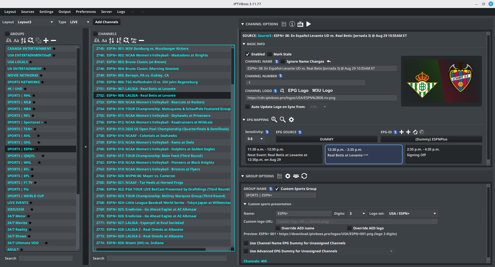
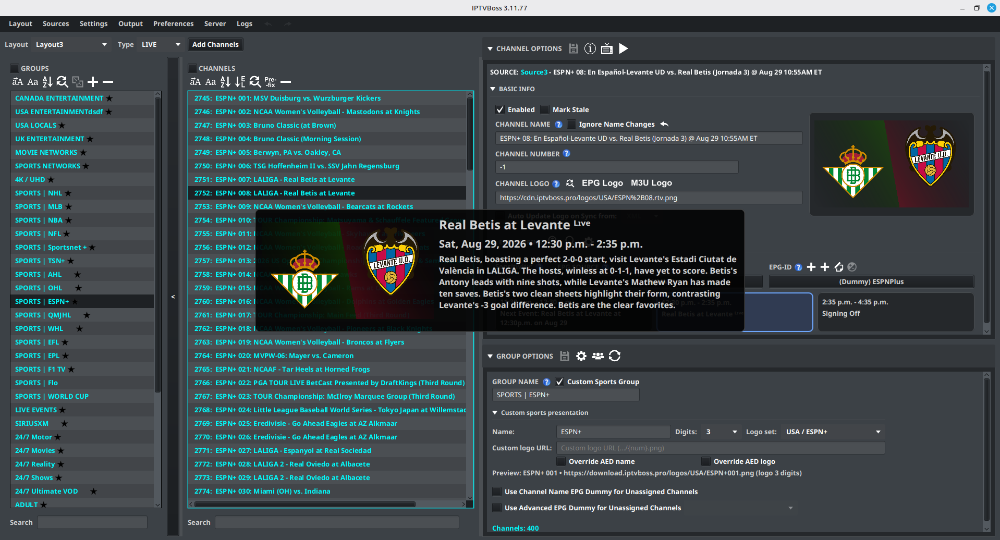

# Custom Sports Groups

PRO [See Free vs Pro](../getting-started/free-vs-pro.md).

Custom Sports groups use sports event data and AED results to organize channels around upcoming, live, favorite, and unmatched events. The group settings control filtering and the order in which those channels appear.

If numbered channels need fixture text for matching, configure [TXT Fixture Names for AEDs](../setup/custom-sports-channel-names.md).

## Create a Custom Sports group

1. Open [Layout Manager](../layouts/layout-manager.md) and select the layout that should contain the sports group.
2. Open [Layout Editor](../layouts/layout-editor.md).
3. Create or select the group that should contain the sports channels.
4. Enable the group’s Custom Sports behavior when the option is available.
5. Add or move sports channels and team-based channels into the group.
6. Confirm that the channels have the required [AED](aed.md) and sports event data.
7. Select { .ui-icon } **Edit Sports Settings** in the **Group Options** header to configure filtering and sorting.
8. Select { .ui-icon } **Refresh AEDs** when the group’s AED results need to be updated. For an application-wide refresh, use **Sources** → **AED Refresh…** and choose **Refresh All** or **Refresh Pending**.
9. Generate output and verify the event order in the resulting playlist.

If the Custom Sports controls are unavailable, confirm that the group is configured for sports behavior and that the required Pro features are active.

## Open sports settings

1. Open the **Layout Editor**.
2. Select a Custom Sports group in the [Layout Editor](../layouts/layout-editor.md).
3. Select { .ui-icon } **Edit Sports Settings** in the **Group Options** header.
4. Change the filters or bucket order.
5. Select **OK**, then refresh or regenerate output to review the result.

## Exclude channels by keyword or phrase

Use **Exclusions** in **Sports Settings** when a provider supplies channels that should never enter the Custom Sports group, such as Spanish-language alternates or duplicate feeds.

1. Open **Edit Sports Settings** for the Custom Sports group.
2. Select **Enable exclusions**.
3. Select **Add** and enter one keyword or phrase, then repeat for each term.
4. Select a saved term and choose **Remove** when it is no longer needed.
5. Select **OK** to save the sports settings.

Matching is case-insensitive and uses the original channel name supplied by the provider. Terms are literal phrases, not regular expressions. A channel is excluded when its original name contains any saved term; a channel without an original provider name is not matched. Exclusions apply only to Custom Sports groups and are applied before AED lookup, sports classification, sorting, and custom presentation numbering, so an excluded channel is removed even when **Remove Channels without Events** is disabled and does not consume a presentation number. The underlying source channel remains available to other groups and layouts. A [linked group](../layouts/linked-groups.md) uses the settings of its linked source group.

## Filtering options

| Setting | Behavior |
| --- | --- |
| **Remove Channels without Events** | Hides channels that currently have no matching event. When disabled, they remain in the group and can appear in **No Event**. |
| **Sort by Time** | Sorts channels by event start time instead of their original channel order. |
| **When sorting by time, move ended events to the bottom** | Keeps ended events in their normal bucket but places them below active and upcoming events. This applies only when **Sort by Time** is enabled. |
| **Only Daily Events** | Limits the group to events happening today. |
| **Treat Team-Based Channels as Event Channels** | Makes team-based channels follow event-style grouping and allows options such as **Only Daily Events** to apply to them. |
| **Enable exclusions** | Removes channels whose original provider name contains one of the saved exclusion terms before sports processing. |

Start with **Remove Channels without Events** and **Only Daily Events** when you want a compact daily sports group. Add **Sort by Time** when the viewing order should follow the schedule.

## Sports sort order

The list in **Sports Settings** contains the buckets used to classify channels. The available buckets include:

- **Fav Events**
- **Fav Teams**
- **Fav Away-Team**
- **Events**
- **Teams**
- **Non-AED**
- **No Event**

Checked buckets move to the top in the order shown. Unchecked buckets remain at the bottom in their original channel order. Select a bucket and use **Move Up** or **Move Down** to change its position. Use **Reset Defaults** to restore the default order for the current sports sorting mode.

!!! note
    A bucket can be enabled or disabled independently of its position. If a channel seems to disappear, check whether its bucket is unchecked or whether **Remove Channels without Events** is enabled.

## Choose favourite teams

Favourite teams can be used to prioritize events and team channels. In the Layout Editor, select the Custom Sports group, then select { .ui-icon } **Select Favorite Teams** in the **Group Options** header.

The selector includes these options:

- **Move ALL Team Channels where my Favorite Team is Playing in the Next Event** moves team channels when one of the selected teams is playing in its next event.
- **Only Move Favorite Events Happening within 24 Hours** limits the favorite-event behavior to events starting within the next 24 hours.

Select **OK** to save the selection. Favorite event and team channels are then classified into the corresponding favorite buckets when the group is refreshed.

## Customize the sports presentation

A Custom Sports group can give its channels a consistent presentation name and numbered logo. This is useful for provider feeds that contain a large set of numbered sports channels, such as **ESPN+ 001**, **ESPN+ 002**, and so on.

1. Select the Custom Sports group in the Layout Editor.
2. Expand **Custom sports presentation** under **Group Options**.
3. Enter a **Name** to use as the channel prefix, such as ESPN+.
4. Choose the number of **Digits**. A value of 3 produces 001, 002, and 003; 0 leaves the number unpadded.
5. Select a numbered **Logo set**, or enter a **Custom logo URL** containing {num}.
6. Review the preview, then select **Save Group(s)**.

The logo set and custom URL are alternatives. A custom URL takes precedence when both are present. The selected catalog set uses the digit width required by that set; the preview shows the resulting URL and width.

Numbering follows the final channel order after the group’s exclusions, filters, and sports sort order are applied. A channel that moves because of favorites, event status, or time sorting receives the number for its new position. Excluded channels and channels with **Ignore Custom Presentation** enabled do not consume a number.

### AED names and logos

By default, a valid AED presentation can still provide the channel name or logo. Use **Override AED name** or **Override AED logo** when every channel in the group should use the group’s numbered presentation instead.

The group presentation is also used by the Layout Editor’s channel list, programme preview, generated M3U output, and other layout views. An example with the programme preview open is shown below.

Prebuilt logo sets are labeled by provider and variant. For example, alternate ESPN+, ESPNPlay, NCAAB, MLB, NBA, NFL, NHL, PPV, and regional sets have distinct names in the selector. Choose the variant whose numbered URL matches the assets you want to publish.

### Skip the presentation for selected channels

When a Custom Sports group has a name prefix or logo configured, eligible channels can enable **Ignore Custom Presentation** in **Channel Options**. The channel keeps its normal name and logo while remaining subject to the group’s sports filtering and sorting. This is useful when one channel in a numbered group should retain its provider or AED presentation.

In **Custom sports presentation**, enable **Exclude linear channels from custom presentation** to keep linear channels in the group while preserving their original names and logos. Only channels assigned to the Dummy EPG source receive the group’s numbered presentation when this option is enabled.

## Verify the result

1. Confirm that the group contains the expected sports and team channels.
2. Refresh the AED results or synchronize the relevant [EPG source](../setup/epg-sources.md). If an AED refresh was paused or left queued, use **Sources** → **AED Refresh…** → **Refresh Pending** to continue it.
3. Check that upcoming events are in time order when **Sort by Time** is enabled.
4. Confirm that ended events move down when the ended-event option is enabled.
5. Check **No Event** and **Non-AED** at the bottom for channels that did not match a sports event.
6. Generate output and verify the resulting channel order in the playlist.

If a channel is classified incorrectly, review its AED matching rules first. Custom Sports sorting can only use the event and team information that the AED and sports EPG provide.
