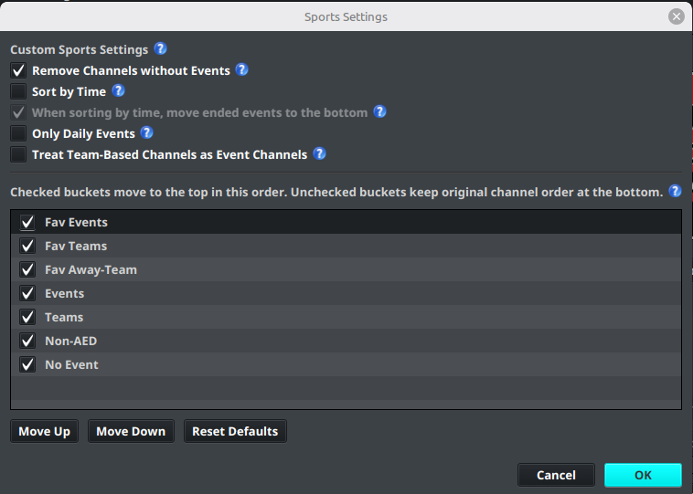
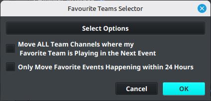

# Custom Sports

Custom Sports groups use sports event data and AED results to organize channels around upcoming, live, favorite, and unmatched events. The group settings control filtering and the order in which those channels appear.

## Open sports settings

1. Open the **Layout Editor**.
2. Select a Custom Sports group.
3. Select **Edit Sports Settings**.
4. Change the filters or bucket order.
5. Select **OK**, then refresh or regenerate output to review the result.

## Filtering options

| Setting | Behavior |
| --- | --- |
| **Remove Channels without Events** | Hides channels that currently have no matching event. When disabled, they remain in the group and can appear in **No Event**. |
| **Sort by Time** | Sorts channels by event start time instead of their original channel order. |
| **When sorting by time, move ended events to the bottom** | Keeps ended events in their normal bucket but places them below active and upcoming events. This applies only when **Sort by Time** is enabled. |
| **Only Daily Events** | Limits the group to events happening today. |
| **Treat Team-Based Channels as Event Channels** | Makes team-based channels follow event-style grouping and allows options such as **Only Daily Events** to apply to them. |

Start with **Remove Channels without Events** and **Only Daily Events** when you want a compact daily sports group. Add **Sort by Time** when the viewing order should follow the schedule.

## Sports sort order

The list in **Sports Settings** contains the buckets used to classify channels. The available buckets include:

- **Fav Events**
- **Fav Teams**
- **Fav Away-Team**
- **Events**
- **Teams**
- **Non-AED**
- **No Event**

Checked buckets move to the top in the order shown. Unchecked buckets remain at the bottom in their original channel order. Select a bucket and use **Move Up** or **Move Down** to change its position. Use **Reset Defaults** to restore the default order for the current sports sorting mode.

!!! note
    A bucket can be enabled or disabled independently of its position. If a channel seems to disappear, check whether its bucket is unchecked or whether **Remove Channels without Events** is enabled.

## Choose favourite teams

Favourite teams can be used to prioritize events and team channels. In the Layout Editor, open the favourite-team selector for the Custom Sports group and select the teams to prioritize.

The selector includes these options:

- **Move ALL Team Channels where my Favorite Team is Playing in the Next Event** moves team channels when one of the selected teams is playing in its next event.
- **Only Move Favorite Events Happening within 24 Hours** limits the favorite-event behavior to events starting within the next 24 hours.

Select **OK** to save the selection. Favorite event and team channels are then classified into the corresponding favorite buckets when the group is refreshed.

## Verify the result

1. Confirm that the group contains the expected sports and team channels.
2. Refresh the AED results or synchronize the relevant EPG data.
3. Check that upcoming events are in time order when **Sort by Time** is enabled.
4. Confirm that ended events move down when the ended-event option is enabled.
5. Check **No Event** and **Non-AED** at the bottom for channels that did not match a sports event.
6. Generate output and verify the resulting channel order in the playlist.

If a channel is classified incorrectly, review its AED matching rules first. Custom Sports sorting can only use the event and team information that the AED and sports EPG provide.
