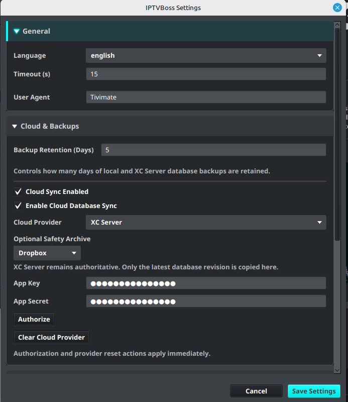

# Completing the First Run

After installation, start IPTVBoss and confirm that the application can open its local configuration and database.

## Start IPTVBoss

1. Start **IPTVBoss** from your operating system’s application menu.
2. Wait for the startup process to finish.
3. Confirm that the main window opens without a database or configuration error.

The first launch creates or opens the local IPTVBoss data used by the application. Keep the application’s data location backed up before making major changes.

## Check your application settings

Open **Settings** → **IPTVBoss Settings** and review the available application settings. Do not change a setting unless you understand what it controls.

Confirm that:

- The application opens normally after restarting.
- The intended database is being used.
- The output location is known before you generate files.
- Your operating system and application version are recorded for support.

## Activate Pro when applicable

If you have an IPTVBoss Pro subscription, follow [IPTVBoss Pro and Account Access](../settings/pro.md) to enter or activate the credentials supplied with your account. Pro-only controls may remain locked until the account is validated.

!!! note
    Do not paste a token, license key, or account credential into a screenshot or support ticket. Describe the error without exposing the secret.

## Existing databases

If you are updating or moving IPTVBoss, do not create a new empty database until you have confirmed that your existing database is backed up. Follow [Updating IPTVBoss](updating.md) and the recovery guidance before restoring data.

## Confirm that setup is complete

The first-run setup is complete when you can:

1. Open **Sources**.
2. Open **Layout Manager**.
3. Open **Settings** without an error.
4. Continue to [Adding a playlist](../setup/playlists.md).

!!! note
    Startup and activation screens may change between releases. Confirm the labels shown by the installed version.
