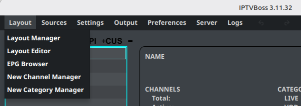

# Layouts

A layout is the publishable arrangement of your IPTV channels. It controls which groups and channels appear in output and which EPG settings apply to them.



The setup relationship is:

```text
Playlist and EPG sources → Layout groups and channels → M3U/EPG output
```

Use a separate layout when different viewers need different channel groups, ordering, or output settings.

## Continue with a layout

1. Start with [Managing layouts](layout-manager.md) to create or select a layout.
2. Use [Editing a layout](layout-editor.md) to organize groups and channels.
3. Use [Mapping channels](../setup/channel-mapping.md) to assign EPG data.
4. Use [Layout Output Settings](output-settings.md) to configure destinations and formats.
5. Use [Creating output](../setup/output.md) to generate the files or links.

!!! note "Basic and Pro"
    Basic accounts have a layout limit. Pro tiers provide higher or unlimited layout capacity according to the subscription.
