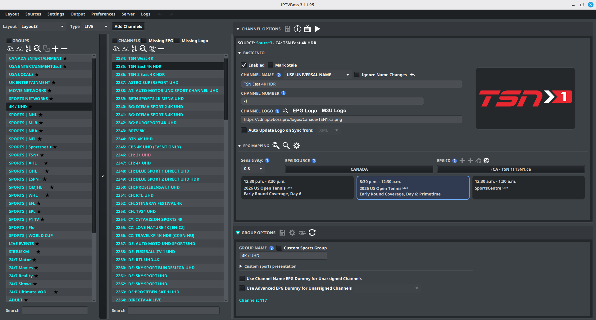
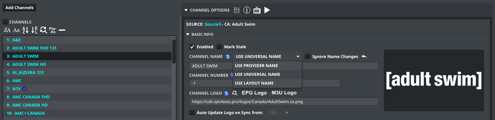
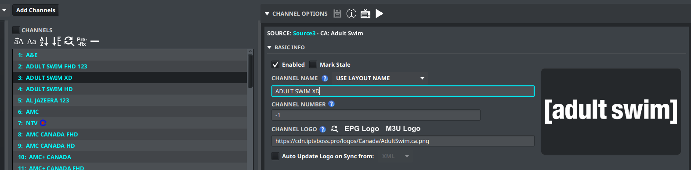
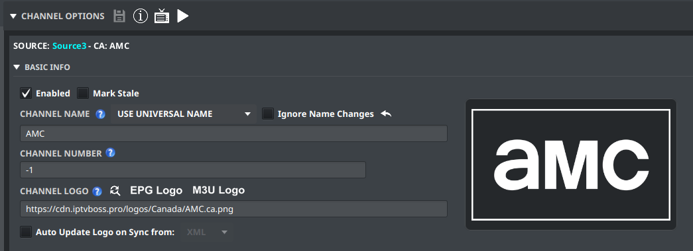
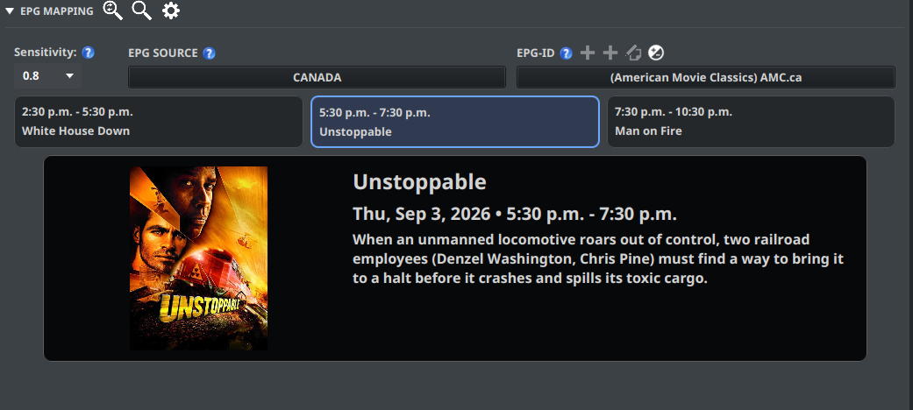

# Editing a Layout

Use **Layout Editor** to control the groups, channels, names, logos, and EPG assignments in a layout.

The editor is divided into three working areas: groups on the left, channels in the middle, and options on the right. You can collapse the group selector with the arrow on its right edge when you need more room.

The right side has two main panels: **Channel Options** and **Group Options**. **Basic Info** and **EPG Mapping** are sections inside **Channel Options**. Select a section header to expand or collapse it. IPTVBoss remembers these choices between uses.

## Select a layout and group

1. Open **Layout** → **Layout Editor**.
2. Select the layout from the layout selector.
3. Select a group.
4. Review the channels in that group.

The **Type** selector filters the editor to Live, VOD, or Series content. Confirm the type before looking for a group or channel that appears to be missing.

## Import channels with Channel Importer

Select **Add Channels** in Layout Editor. Follow [Importing Channels](importing-channels.md) for the complete workflow.

- [Import from a source](importing-channels.md#import-from-a-source)
- [Import from another layout](importing-channels.md#import-from-another-layout)
- [Linked Layout Groups](importing-channels.md#linked-layout-groups)
- [Avoid accidental imports](importing-channels.md#avoid-accidental-imports)

## Edit a channel

1. Select a channel.
2. Expand **Channel Options**, then expand **Basic Info**.
3. Change the channel name, number, logo, or other available field.
4. Expand **EPG Mapping** to assign or review its EPG source and EPG-ID.
5. Select { .ui-icon } **Save Channel(s)** in the **Channel Options** header.

The **Channel Options** header also provides these actions:

| Control | What it does |
| --- | --- |
| { .ui-icon } **Save Channel(s)** | Saves changes for the selected channels. |
| { .ui-icon } **Channel Info** | Opens more information about the selected channel. |
| { .ui-icon } **Open EPG** | Opens the programme guide for the selected channel. |
| { .ui-icon } **Open Stream** | Opens the selected channel’s video stream. |

In **Basic Info**, select { .ui-icon } **Revert to Provider Name** beside **Channel Name** to restore the name supplied by the playlist source. Beside **Channel Logo**, { .ui-icon } **Find and Replace** updates logo text or links for selected channels; **EPG Logo** and **M3U Logo** copy the logo from the corresponding source when one is available.

For a channel in a Custom Sports group with a configured presentation, **Ignore Custom Presentation** keeps that channel’s normal name and logo. The channel still participates in the group’s exclusions, AED processing, sports classification, and sorting. Select the checkbox and save the channel change; it can be applied to multiple eligible channels.

### Choose the channel name source

Each layout channel has a name mode beside **Channel Name**. The mode controls the name used by that layout’s playlist, guide, and player output:

| Mode | Behavior |
| --- | --- |
| **USE PROVIDER NAME** | Uses the original name received from the playlist provider. The name field is not editable in this mode. |
| **USE UNIVERSAL NAME** | Uses the normal IPTVBoss channel name, including applicable AED and source-prefix processing. This is the default mode for existing and newly added layout channels. |
| **USE LAYOUT NAME** | Stores a custom name for this layout channel only. The same source channel can therefore have different names in different layouts. |

Select one channel before changing the mode. The selector is disabled for a multi-channel selection. When **USE LAYOUT NAME** is selected, edit the name field and save the channel.

The name actions above the channel list apply only to channels whose names can be changed. They skip channels using **USE PROVIDER NAME**. **Revert to Provider Name** and **Ignore Name Changes** apply to the universal-name workflow; the revert action restores the provider-supplied name while leaving the channel in the universal-name mode.

For a universal-name channel, enable **Ignore Name Changes** when AED or source synchronization must not replace the current universal name. The control is available for the applicable selected channels and can show a mixed state when selected channels have different values.

To edit the channel name directly, select a channel that uses **USE UNIVERSAL NAME** or **USE LAYOUT NAME**, then double-click the channel row or edit the **Channel Name** field. Press **Enter** to commit the edit or **Esc** to cancel it. Right-click a channel row for actions such as enabling or disabling channels, removing channels, moving selected channels to the top or bottom, and cutting, copying, or pasting channels.

For source-wide cleanup, see [Prefix Removal and Tags](../setup/source-tools.md). For display and sorting options, see [Preferences and Theme](../settings/preferences.md).

Keep channel names consistent with the service you are editing. If you change a name only to improve matching, record the original name somewhere before saving.

## Organize groups and channels

Use the layout editor controls to:

- Create or rename groups.
- Move channels between groups.
- Reorder groups and channels.
- Remove items that should not appear in this output.

Click a group or channel row to select it. The group and channel lists support multiple selection; use Ctrl-click on Windows/Linux or Command-click on macOS to add individual rows to the selection. Drag a selected group or channel onto its new position to reorder it, or drag a channel onto a group to move it there. Review the destination before releasing the mouse because a drop changes the layout immediately.

Double-click a group name to edit it. Use the icon buttons above the lists for bulk actions such as sorting, renaming, merging, removing, and adding groups or channels.

## Edit group options

Select a group, then expand **Group Options** on the right. Edit **Group Name** or the available group settings, then select { .ui-icon } **Save Group(s)**. The group options header also contains **Ignore Empty Group Health Check** for suppressing the selected group’s empty-group health warning.

The **Group Options** header can also contain:

| Control | What it does |
| --- | --- |
| { .ui-icon } **Edit Sports Settings** | Configures filtering and sorting for a Custom Sports group. |
| { .ui-icon } **Select Favorite Teams** | Chooses teams to prioritize in a Custom Sports group. |
| { .ui-icon } **Refresh AEDs** | Refreshes AED results for the group’s channels. The operation can be cancelled and reports its results when it finishes. |

Sports controls appear only for a group configured as a **Custom Sports Group**.

For an application-wide refresh, use **Sources** → **AED Refresh…**. **Refresh All** checks all configured AED channels; **Refresh Pending** continues queued work from an earlier paused or incomplete refresh. See [Test and refresh an AED](../features/aed.md#test-and-refresh-an-aed) for the progress view and completion metrics.

### Custom sports presentation

When **Custom Sports Group** is enabled, expand **Custom sports presentation** in **Group Options** to configure a numbered channel presentation. Set the name prefix and number padding, choose a prebuilt logo set or enter a custom {num} logo URL, and decide whether the presentation should override AED names or logos. The section includes a live preview of the generated name and logo URL.

Enable **Exclude linear channels from custom presentation** to leave linear channels in the group with their original names and logos. Only Dummy EPG channels receive the numbered custom presentation with this option enabled. Select **Edit Sports Settings** to manage keyword or phrase exclusions; those exclusions remove matching channels before sports processing.

See [Custom Sports Groups](../features/custom-sports.md#customize-the-sports-presentation) for the complete setup and numbering behavior.

Review the selected layout after each bulk change. A change made in one layout does not automatically change another layout.

## EPG mapping controls

Follow [Mapping Channels](../setup/channel-mapping.md) to choose and save an EPG assignment.

Inside **EPG Mapping**, the header buttons are:

| Control | What it does |
| --- | --- |
| { .ui-icon } **Auto** | Attempts to assign an EPG match automatically using the sensitivity setting. |
| { .ui-icon } **Manual** | Displays likely EPG matches so you can choose one. |
| { .ui-icon } **EPG Search Options** | Chooses which existing EPG sources Auto and Manual search. The button tooltip is **Search Options**. |

From left to right, the buttons beside **EPG-ID** are { .ui-icon } **Add Dummy EPG**, { .ui-icon } **Add Advanced Dummy EPG**, { .ui-icon } **Edit Dummy EPG**, and { .ui-icon } **EPG Offset**. The two Add buttons use the same plus icon, so use their position or hover tooltip to distinguish them. Some controls are available only when the selected channel or account supports them.

## Programme preview

The editor can show programme information when preview data is available. The three programme cards show the previous, current, and next entries for the selected EPG mapping.

When **Show Full Preview in-line in Channel Options** is enabled, select a programme card to display its artwork, title, time, and description below the cards. The selected card is highlighted, and the inline preview replaces the delayed hover overlay.

When inline preview is disabled, **Enable Full Preview Overlays** can show the full preview as a delayed overlay when you hover over a programme card. The preview size is controlled from [Layout Editor settings](../settings/application.md#layout-editor-settings).

## Identify the group and channel controls

The buttons above the **Groups** and **Channels** lists apply to the selected rows. Hover over an icon in IPTVBoss to display its name before using a bulk action.

### Group controls

| Control | What it does |
| --- | --- |
| { .ui-icon } **Uppercase** | Changes selected group names to uppercase. |
| { .ui-icon } **Sentence Case** | Changes selected group names to sentence case. |
| { .ui-icon } **Sort A to Z** | Sorts the groups alphabetically. |
| { .ui-icon } **Find and Replace** | Finds or replaces text in selected group names. |
| { .ui-icon } **Merge Groups** | Combines the selected groups. |
| { .ui-icon } **Add Group** | Creates a group in the current layout. |
| { .ui-icon } **Remove Group** | Removes the selected groups. |

### Channel controls

| Control | What it does |
| --- | --- |
| { .ui-icon } **Uppercase** | Changes selected channel names to uppercase. |
| { .ui-icon } **Sentence Case** | Changes selected channel names to sentence case. |
| { .ui-icon } **Sort A to Z** | Sorts channels alphabetically. |
| { .ui-icon } **Find and Replace** | Finds or replaces text in selected channel names. |
| { .ui-icon } **Add Prefix/Suffix** | Adds text before or after selected channel names. |
| { .ui-icon } **Remove Channel** | Removes selected channels from the layout. |

### Filter channels by missing EPG or logo

Use the **Missing EPG** and **Missing Logo** checkboxes beside the **CHANNELS** heading to narrow the channel list. **Missing EPG** shows live channels without a usable EPG mapping. **Missing Logo** shows channels whose source channel has no logo. If both are selected, a channel is shown when it matches either condition. These filters can be combined with the channel search field.

While a missing-content filter or a health-focused view is active, channel reordering and drag-and-drop importing are disabled. Clear the filters before changing channel order or importing onto the channel list.

## Ignore an intentional empty-group warning

Select a group and expand **Group Options**. Enable **Ignore Empty Group Health Check** when the group is intentionally empty and should not be counted by Layout Manager as an empty-group health issue.

This is a per-group health preference. It does not add channels, disable the group, or change source synchronization. It also does not stop **Remove Empty Layout Groups After Source Sync** from removing the group when that per-layout cleanup option is enabled. Save the group after changing the checkbox.

## Check the result

Before generating output, confirm that:

1. The layout is enabled when it should be.
2. Required groups and channels are present.
3. EPG mappings are assigned to the intended channels.
4. Logos and names are correct.
5. The layout is saved.

!!! warning
    Do not use a destructive bulk action until you have selected the intended layout, group, or channel set.
