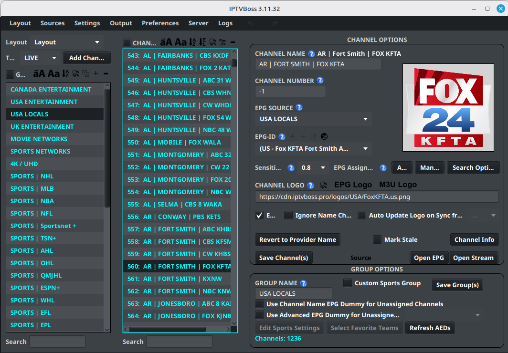
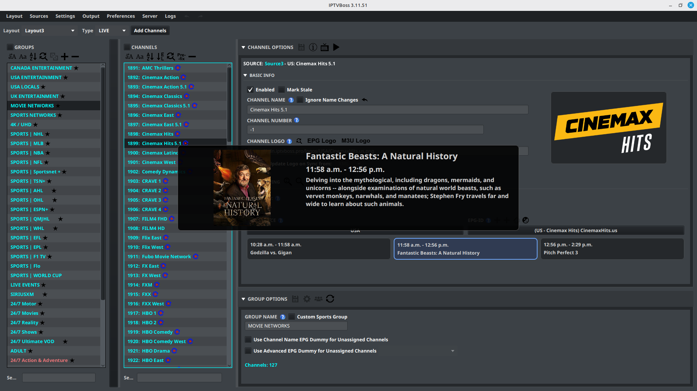
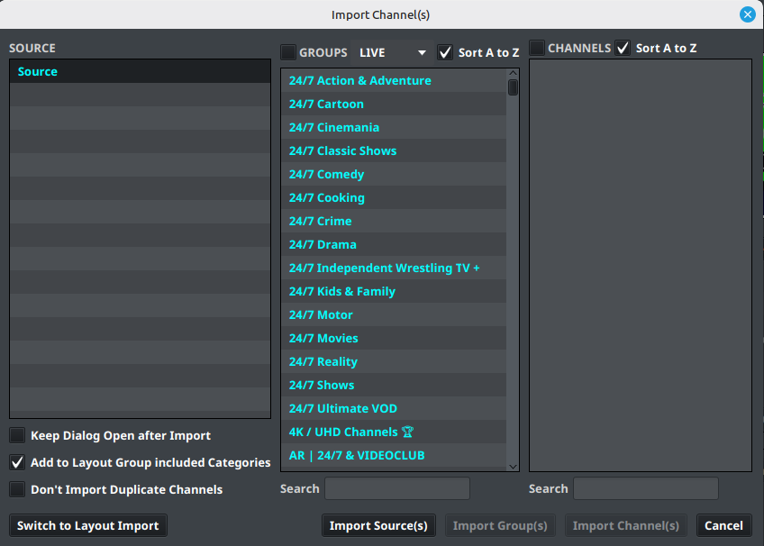
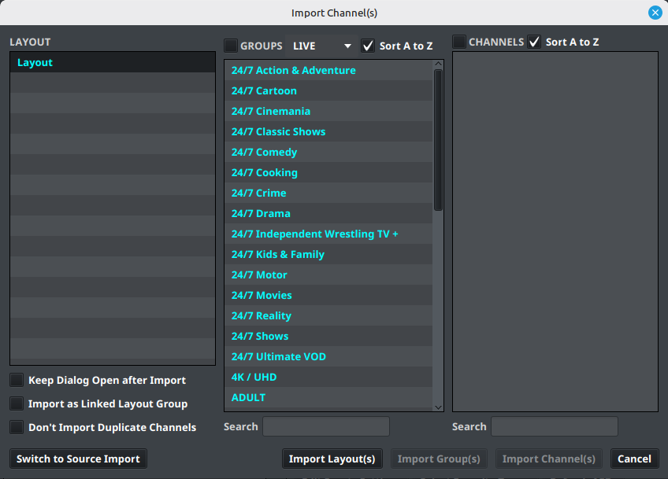

# Editing a Layout

Use **Layout Editor** to control the groups, channels, names, logos, and EPG assignments in a layout.

The editor is divided into three working areas: groups on the left, channels in the middle, and options on the right. You can collapse the group selector with the arrow on its right edge when you need more room.

The right side has two main panels: **Channel Options** and **Group Options**. **Basic Info** and **EPG Mapping** are sections inside **Channel Options**. Select a section header to expand or collapse it. IPTVBoss remembers these choices between uses.

### Editor with programme preview

The editor can show a programme preview over the channel details when preview information is available. This view helps confirm programme metadata, descriptions, and artwork while you work on a channel.

## Select a layout and group

1. Open **Layout** → **Layout Editor**.
2. Select the layout from the layout selector.
3. Select a group.
4. Review the channels in that group.

The **Type** selector filters the editor to Live, VOD, or Series content. Confirm the type before looking for a group or channel that appears to be missing.

## Identify the group and channel controls

The buttons above the **Groups** and **Channels** lists apply to the selected rows. Hover over an icon in IPTVBoss to display its name before using a bulk action.

### Group controls

| Control | What it does |
| --- | --- |
| { .ui-icon } **Uppercase** | Changes selected group names to uppercase. |
| { .ui-icon } **Sentence Case** | Changes selected group names to sentence case. |
| { .ui-icon } **Sort A to Z** | Sorts the groups alphabetically. |
| { .ui-icon } **Find and Replace** | Finds or replaces text in selected group names. |
| { .ui-icon } **Merge Groups** | Combines the selected groups. |
| { .ui-icon } **Add Group** | Creates a group in the current layout. |
| { .ui-icon } **Remove Group** | Removes the selected groups. |

### Channel controls

| Control | What it does |
| --- | --- |
| { .ui-icon } **Uppercase** | Changes selected channel names to uppercase. |
| { .ui-icon } **Sentence Case** | Changes selected channel names to sentence case. |
| { .ui-icon } **Sort A to Z** | Sorts channels alphabetically. |
| { .ui-icon } **Sort by Missing EPG/Logo** | Brings channels missing an EPG mapping or logo together for review. |
| { .ui-icon } **Find and Replace** | Finds or replaces text in selected channel names. |
| { .ui-icon } **Add Prefix/Suffix** | Adds text before or after selected channel names. |
| { .ui-icon } **Remove Channel** | Removes selected channels from the layout. |

## Import channels with Channel Importer

Select **Add Channels** in the Layout Editor to open **Channel Importer**. The importer has two modes:

- **Source Import** adds groups and channels from an imported playlist or API source.
- **Layout Import** adds groups and channels that already exist in another layout.

Use **Switch to Layout Import** or **Switch to Source Import** at the bottom of the dialog to change modes. The selected mode determines whether the left-hand list is labeled **Source** or **Layout**.

### Import from a source

In Source Import mode:

1. Select a source in the left panel.
2. Select a group in the middle panel to display its channels in the right panel. Use the **GROUPS** and **CHANNELS** checkboxes when you want to select items in bulk.
3. Select one or more groups or channels to import. Use the search field under a panel to find a matching item.
4. Choose **Import Source(s)**, **Import Group(s)**, or **Import Channel(s)**, depending on what is selected.

The **LIVE** dropdown filters the source content by the available content type. **Sort A to Z** controls the order shown in the group and channel lists. Sorting changes the display order in the dialog; it does not by itself reorder the destination layout.

The source importer also provides these options:

- **Keep Dialog Open after Import** leaves the importer open so you can repeat imports from the same source.
- **Add to Layout Group included Categories** adds imported source categories to the destination layout group when that grouping option is available. Use it when the source categories should become part of the selected layout group; leave it off when the imported categories should remain separate.
- **Don't Import Duplicate Channels** skips channels that are already present instead of adding another copy. Enable it for incremental imports and review the destination before disabling it.

### Import from another layout

In Layout Import mode:

1. Select the source layout in the left panel.
2. Select a group in the middle panel to display its channels in the right panel.
3. Select the groups or channels to bring into the current layout.
4. Choose **Import Layout(s)**, **Import Group(s)**, or **Import Channel(s)**.

The layout importer is useful when a second layout needs some of the same channel organization as an existing layout. It copies selected content into the layout currently open in the editor; confirm the destination layout before importing.

### Linked Layout Groups

Enable **Import as Linked Layout Group** when the imported group should remain linked to its originating layout group rather than becoming an independent copy. This is useful when several layouts should reuse the same group structure and follow its source layout over time.

Leave the option disabled when the destination needs to be edited independently. A linked group should be treated as shared configuration: review the originating layout before making changes, and verify the resulting channels in every layout that uses the link.

### Avoid accidental imports

Before selecting an import button, confirm the current mode, the source or layout in the left panel, the selected groups and channels, and the destination layout. If the result is not expected, undo or remove the imported items before generating output.

## Edit a channel

1. Select a channel.
2. Expand **Channel Options**, then expand **Basic Info**.
3. Change the channel name, number, logo, or other available field.
4. Expand **EPG Mapping** to assign or review its EPG source and EPG-ID.
5. Select { .ui-icon } **Save Channel(s)** in the **Channel Options** header.

The **Channel Options** header also provides these actions:

| Control | What it does |
| --- | --- |
| { .ui-icon } **Save Channel(s)** | Saves changes for the selected channels. |
| { .ui-icon } **Channel Info** | Opens more information about the selected channel. |
| { .ui-icon } **Open EPG** | Opens the programme guide for the selected channel. |
| { .ui-icon } **Open Stream** | Opens the selected channel’s video stream. |

In **Basic Info**, select { .ui-icon } **Revert to Provider Name** beside **Channel Name** to restore the name supplied by the playlist source. Beside **Channel Logo**, { .ui-icon } **Find and Replace** updates logo text or links for selected channels; **EPG Logo** and **M3U Logo** copy the logo from the corresponding source when one is available.

Inside **EPG Mapping**, the header buttons are:

| Control | What it does |
| --- | --- |
| { .ui-icon } **Auto** | Attempts to assign an EPG match automatically using the sensitivity setting. |
| { .ui-icon } **Manual** | Displays likely EPG matches so you can choose one. |
| { .ui-icon } **EPG Search Options** | Chooses which existing EPG sources Auto and Manual search. The button tooltip is **Search Options**. |

From left to right, the buttons beside **EPG-ID** are { .ui-icon } **Add Dummy EPG**, { .ui-icon } **Add Advanced Dummy EPG**, { .ui-icon } **Edit Dummy EPG**, and { .ui-icon } **EPG Offset**. The two Add buttons use the same plus icon, so use their position or hover tooltip to distinguish them. Some controls are available only when the selected channel or account supports them.

To edit the channel name directly, double-click the channel row. Press **Enter** to commit the edit or **Esc** to cancel it. Right-click a channel row for actions such as enabling or disabling channels, removing channels, moving selected channels to the top or bottom, and cutting, copying, or pasting channels.

Keep channel names consistent with the service you are editing. If you change a name only to improve matching, record the original name somewhere before saving.

## Organize groups and channels

Use the layout editor controls to:

- Create or rename groups.
- Move channels between groups.
- Reorder groups and channels.
- Remove items that should not appear in this output.

Click a group or channel row to select it. The group and channel lists support multiple selection; use Ctrl-click on Windows/Linux or Command-click on macOS to add individual rows to the selection. Drag a selected group or channel onto its new position to reorder it, or drag a channel onto a group to move it there. Review the destination before releasing the mouse because a drop changes the layout immediately.

Double-click a group name to edit it. Use the icon buttons above the lists for bulk actions such as sorting, renaming, merging, removing, and adding groups or channels.

## Edit group options

Select a group, then expand **Group Options** on the right. Edit **Group Name** or the available group settings, then select { .ui-icon } **Save Group(s)**.

The **Group Options** header can also contain:

| Control | What it does |
| --- | --- |
| { .ui-icon } **Edit Sports Settings** | Configures filtering and sorting for a Custom Sports group. |
| { .ui-icon } **Select Favorite Teams** | Chooses teams to prioritize in a Custom Sports group. |
| { .ui-icon } **Refresh AEDs** | Refreshes AED results for the group’s channels. |

Sports controls appear only for a group configured as a **Custom Sports Group**.

Review the selected layout after each bulk change. A change made in one layout does not automatically change another layout.

## Check the result

Before generating output, confirm that:

1. The layout is enabled when it should be.
2. Required groups and channels are present.
3. EPG mappings are assigned to the intended channels.
4. Logos and names are correct.
5. The layout is saved.

!!! warning
    Do not use a destructive bulk action until you have selected the intended layout, group, or channel set.
