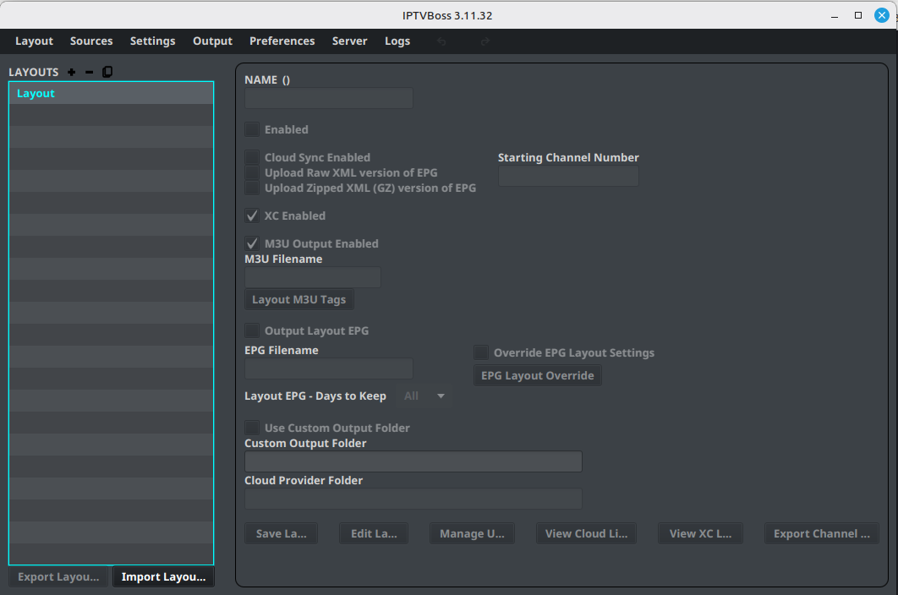

# Managing Layouts

Use **Layout Manager** to create, select, duplicate, remove, import, and export layouts.

The redesigned Layout Manager adapts to the size of its window. Its three sections—**General**, **Output & Sync**, and **Advanced / Custom**—can each be expanded or collapsed from the section header. IPTVBoss remembers those choices the next time you open the screen, so you can keep frequently used settings visible while reducing clutter on smaller screens.

## Create a layout

1. Open **Layout Manager**.
2. Select **Add Layout**.
3. Enter a descriptive layout name.
4. Review the layout’s output and synchronization settings.
5. Select **Save Layout**.

Give the layout a name that describes its audience or purpose, such as `Family`, `Sports`, or `Living Room`.

## Open a layout

1. Select a layout in the list.
2. Select **Edit Layout**, or double-click the layout.
3. Confirm that the expected groups and channels are displayed.

## Enable or disable a layout

Use the layout’s enabled control when you want it included or excluded from operations that process enabled layouts. Confirm the selected state before generating output.

## Duplicate a layout

1. Select the layout to copy.
2. Select the duplicate action.
3. Give the copy a new name.
4. Open the copy and adjust its groups, channels, and output settings.

Duplicating is useful when two outputs share most of the same channels.

## Remove a layout

Before removing a layout, confirm that no player, user, cloud link, or scheduled process still depends on it. Export or back up important configuration before destructive changes.

!!! note "Basic and Pro"
    Free accounts have a limited number of layouts. If the layout limit is reached, remove an unused layout or activate 💲 Pro before creating another one. See [Free vs Pro](../getting-started/free-vs-pro.md).
