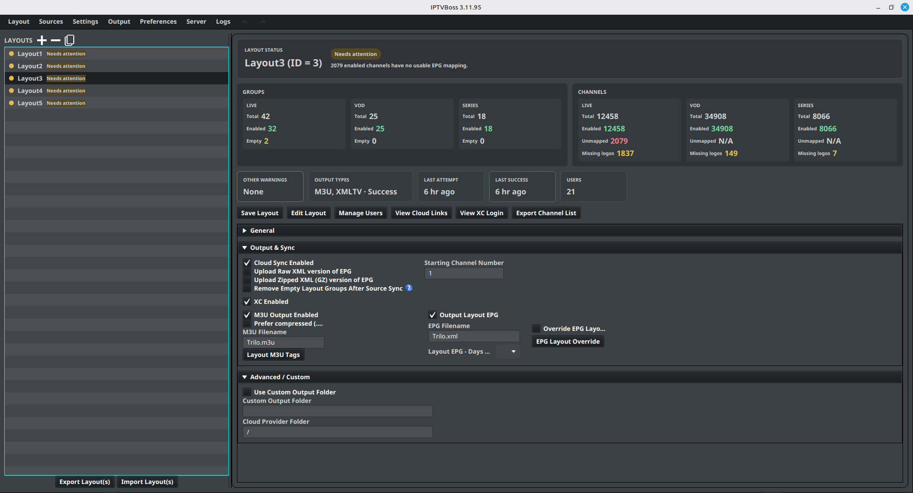

# Managing Layouts

Use **Layout Manager** to create, select, duplicate, remove, import, and export layouts.

The Layout Manager uses a split view: layouts are listed on the left and the selected layout’s status, inventory, actions, and settings appear on the right. The dashboard adapts to the available width. Its three settings sections—**General**, **Output & Sync**, and **Advanced / Custom**—can each be expanded or collapsed from the section header.

## Create a layout

1. Open **Layout** → **Layout Manager**.
2. Select { .ui-icon } **Add New Layout** above the layout list.
3. Enter a descriptive layout name.
4. Review the layout’s output and synchronization settings.
5. Select **Save Layout**.

Give the layout a name that describes its audience or purpose, such as `Family`, `Sports`, or `Living Room`.

## Open a layout

1. Select a layout in the list.
2. Select **Edit Layout**, or double-click the layout.
3. Confirm that the expected groups and channels are displayed.

## Enable or disable a layout

Use the layout’s enabled control when you want it included or excluded from operations that process enabled layouts. Confirm the selected state before generating output.

## Duplicate a layout

1. Select the layout to copy.
2. Select { .ui-icon } **Duplicate Layout** above the layout list.
3. Give the copy a new name.
4. Open the copy and adjust its groups, channels, and output settings.

Duplicating is useful when two outputs share most of the same channels. Use [Linked Layout Groups](linked-groups.md) when groups should follow their originating layout over time.

## Import and export layout files

Follow [Import and Export Layout Files](layout-files.md) to transfer selected layouts, resolve imported sources, or export a CSV channel inventory.

## Use the layout settings sections

The selected layout’s settings are grouped so the status dashboard remains visible while you work:

- **General** contains the layout name and enabled state.
- **Output & Sync** contains cloud sync, EPG upload, empty-group cleanup, XC output, M3U output, XMLTV output, channel numbering, and output filenames.
- **Advanced / Custom** contains the custom output folder and cloud-provider folder.

Expand only the section you need when working in a smaller window. IPTVBoss remembers the section state between uses.

## Read layout health

Select a layout to populate the dashboard. The layout list and status header use these states:

- **Healthy** — the layout content and last output are healthy.
- **Needs attention** — one or more enabled attention checks found a content, structure, or output condition to review.
- **Output failed** — the last output attempt failed; the status reason contains the output error when available.
- **Disabled** — the layout is disabled and will not be generated.
- **No output configured** — none of M3U, XMLTV, or XC output is enabled for the layout.

The **Groups** and **Channels** panels show totals and enabled counts for **LIVE**, **VOD**, and **SERIES**. Live channels also show the number that are not mapped to a usable EPG source. VOD and Series show **N/A** because those content types are not EPG-mappable. Each content type also shows its enabled channels that have no logo. Select a missing-logo value to open Layout Editor with the matching content focused. The lower cards show **Other Warnings**, **Output Types**, **Last Attempt**, **Last Success**, and assigned **Users**.

The dashboard is interactive. Select a group or channel metric to open Layout Editor with the related content in focus. Select an empty-group count or the live **Unmapped** count to review the affected groups or channels. The warning and output cards open the selected layout in the editor so you can investigate the details. A health-focused editor view is cleared when you change the layout, group, or channel selection.

The values are a current inventory, not a replacement for checking the generated playlist or guide. After changing a source, group, mapping, or output setting, save the layout and review the dashboard again.

For broken links, follow [Linked Layout Groups](linked-groups.md#investigate-a-broken-or-empty-link).

## Configure attention checks

Open **Settings** → **IPTVBoss Settings** → **Layout Manager**. See [Layout Manager attention checks](../settings/application.md#layout-manager-attention-checks) for the available controls. Disabling a check removes that condition from the health decision; it does not repair the layout or change output.

## Control empty-group health

An empty group is normally reported as a layout-health issue. If an intentionally empty group should remain without affecting the layout status, open that group in Layout Editor and enable **Ignore Empty Group Health Check** in **Group Options**. This setting changes only the health calculation; it does not remove the group, disable it, or prevent future channels from being added.

The setting is stored per group. Leave it disabled for groups that should contain channels and require review when they become empty.

## Remove empty groups after source sync

Enable **Remove Empty Layout Groups After Source Sync** when a layout should automatically discard groups that no longer contain any layout channels after a successful source synchronization.

This is a per-layout setting. It runs only after the source sync completes successfully. Groups that still contain layout channels are kept, including groups whose sports channels do not currently have a matched event. A linked group is removed when its linked source group is missing or has no layout channels. **Ignore Empty Group Health Check** affects the health dashboard only; it does not prevent this cleanup setting from removing an empty group.

Because this changes the layout structure, export or back up the database before enabling it if empty groups may be intentional. Review the layout after the next source sync and disable the setting when groups should be retained for later imports.

## Remove a layout

Select the layout, then select { .ui-icon } **Remove Layout** above the layout list. Confirm the removal only after checking that the correct layout is selected.

Before removing a layout, confirm that no player, user, cloud link, or scheduled process still depends on it. Export or back up important configuration before destructive changes.

!!! note "Free and Pro"
    Layout limits are listed only in the canonical [Free vs Pro comparison](../getting-started/free-vs-pro.md). If you reach the current limit, remove an unused layout or review the available Pro plans.
