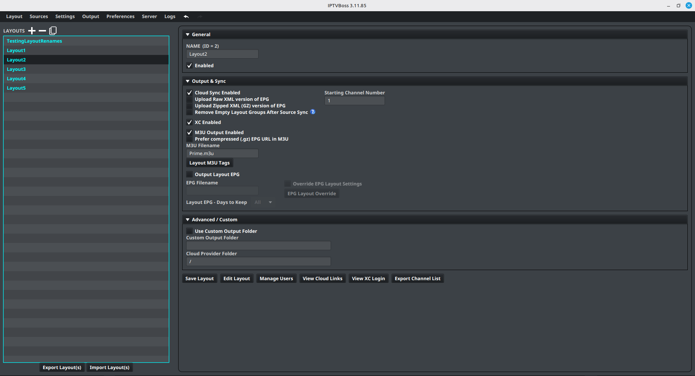

# Managing Layouts

Use **Layout Manager** to create, select, duplicate, remove, import, and export layouts.

The redesigned Layout Manager adapts to the size of its window. Its three sections—**General**, **Output & Sync**, and **Advanced / Custom**—can each be expanded or collapsed from the section header. IPTVBoss remembers those choices the next time you open the screen, so you can keep frequently used settings visible while reducing clutter on smaller screens.

## Remove empty groups after source sync

Enable **Remove Empty Layout Groups After Source Sync** when a layout should automatically discard groups that no longer contain any layout channels after a successful source synchronization.

This is a per-layout setting. It runs only after the source sync completes successfully. Groups that still contain layout channels are kept, including groups whose sports channels do not currently have a matched event. A linked group is removed when its linked source group is missing or has no layout channels.

Because this changes the layout structure, export or back up the database before enabling it if empty groups may be intentional. Review the layout after the next source sync and disable the setting when groups should be retained for later imports.

## Create a layout

1. Open **Layout** → **Layout Manager**.
2. Select { .ui-icon } **Add New Layout** above the layout list.
3. Enter a descriptive layout name.
4. Review the layout’s output and synchronization settings.
5. Select **Save Layout**.

Give the layout a name that describes its audience or purpose, such as `Family`, `Sports`, or `Living Room`.

## Open a layout

1. Select a layout in the list.
2. Select **Edit Layout**, or double-click the layout.
3. Confirm that the expected groups and channels are displayed.

## Enable or disable a layout

Use the layout’s enabled control when you want it included or excluded from operations that process enabled layouts. Confirm the selected state before generating output.

## Duplicate a layout

1. Select the layout to copy.
2. Select { .ui-icon } **Duplicate Layout** above the layout list.
3. Give the copy a new name.
4. Open the copy and adjust its groups, channels, and output settings.

Duplicating is useful when two outputs share most of the same channels.

## Remove a layout

Select the layout, then select { .ui-icon } **Remove Layout** above the layout list. Confirm the removal only after checking that the correct layout is selected.

Before removing a layout, confirm that no player, user, cloud link, or scheduled process still depends on it. Export or back up important configuration before destructive changes.

!!! note "Free and Pro"
    Layout limits are listed only in the canonical [Free vs Pro comparison](../getting-started/free-vs-pro.md). If you reach the current limit, remove an unused layout or review the available Pro plans.
