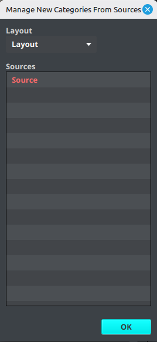

# New Category Manager

The **New Category Manager** controls which sources may add newly discovered categories to a layout automatically. It is a layout-level rule, not a source-wide setting.

When a source is enabled for a layout in this manager, any categories that appear for the first time during a later source update are automatically added to that layout. The new category and its available channels can then be reviewed and organized in the layout.

## Enable a source for a layout

1. Open **Layout** → **New Category Manager**.
2. Select the target **Layout**.
3. Review the source list.
4. Select one or more sources and right-click them to toggle their status.
5. Enabled sources are highlighted. Select **OK** to close the manager.
6. Synchronize the source or wait for its next scheduled update.

The setting is stored on the selected layout. Selecting a different layout shows that layout's own source selections. A source can therefore add new categories to one layout while remaining unchanged in another.

## What it does—and what it does not do

New Category Manager is useful when a provider frequently creates categories and you do not want to add each new category manually. It automatically brings newly discovered categories from the enabled source into the selected layout during source processing.

It does not:

- enable or disable the source itself;
- change which categories the source downloads;
- automatically apply a new category to a particular existing layout group;
- change category rules configured in New Channel Manager.

After a new category is added, review the layout groups and use [New Channel Manager](new-channel-manager.md) if channels from that category should automatically enter a particular group in future updates.
