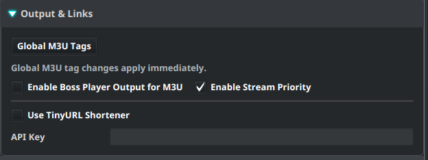
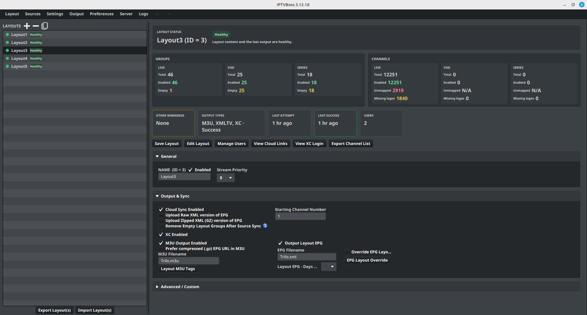
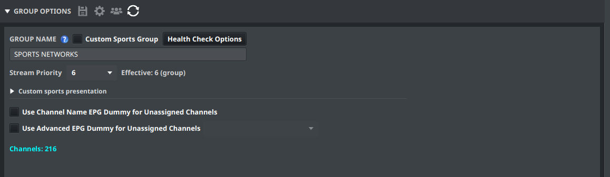
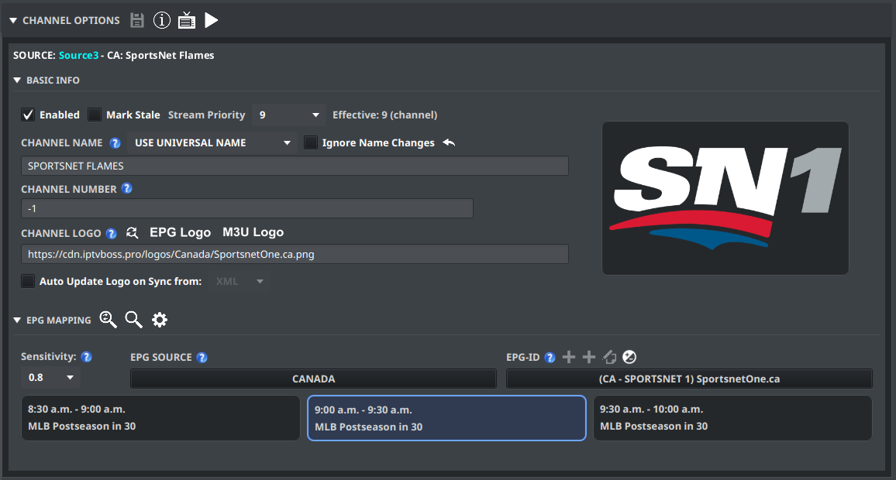

# Stream Priority

**Stream Priority**, introduced in IPTVBoss 3.12.18, assigns live channels a value from **0 (lowest)** to **9 (highest)**. A compatible player can use that value to put preferred streams first in search results or event channel lists, including Sports Hub.

For example, an MLB game might be available on hundreds of local channels and several dedicated sports streams across your layouts. Giving your preferred sports streams a higher priority lets a player that supports this metadata rank them ahead of the alternatives.

Priority does not change channel order or channel numbers in IPTVBoss, remove matching channels, or affect movies and series. Player support is required for it to affect the player's lists.

## Enable or disable Stream Priority

1. Open **Settings → IPTVBoss Settings**.
2. Expand **Output & Links**.
3. Set **Enable Stream Priority**, beside **Enable Boss Player Output for M3U**.
4. Select **Save Settings**.

**Enable Stream Priority** defaults to enabled. It controls both the priority controls in Layout Manager and Layout Editor and the metadata included in M3U and XC output. It is independent of **Enable Boss Player Output for M3U**; you do not need to enable Boss Player Output to use priority.

Turning it off hides the controls and omits priority metadata from newly generated output. Saved priorities remain intact and are available when you enable it again. Existing output and player data need to be refreshed after changing this setting.

## Set the layout default

1. Open **Layout → Layout Manager** and select a layout.
2. Expand **General**.
3. Choose **Stream Priority** beside **Name**.
4. Select **Save Layout**.

The layout default starts at `0`. Live channels use this value unless their group or the channel itself has an explicit override. Changing the layout default preserves those overrides; new channels inherit automatically.

## Set a group override

1. Open the layout in **Layout Editor**, with **Type** set to **Live**.
2. Select a group and expand **Group Options**.
3. Choose a value from `0` to `9` in **Stream Priority**, or choose **Inherit** to use the layout default.
4. Select { .ui-icon } **Save Group(s)** in the panel header.

A group override applies to its live channels that do not have their own override. It is available for ordinary live groups as well as Custom Sports groups.

## Set a channel override

1. Select a live channel in **Layout Editor**.
2. Expand **Channel Options → Basic Info**.
3. Use **Stream Priority**, on the same row as **Mark Stale**.
4. Choose `0` to `9`, or **Inherit** to use the group override or layout default.
5. Select { .ui-icon } **Save Channel(s)**.

To edit several channels together, select them using Ctrl-click on Windows/Linux or Command-click on macOS, choose the priority or **Inherit**, and select **Save Channel(s)**. When selected channels have different settings, the dropdown shows **Mixed — unchanged**. Their priorities stay unchanged until you choose an option.

## Understand inheritance and Effective

Priority resolves in this order: **explicit channel value → explicit group value → layout default**. **Effective** shows the resolved value and where it comes from, such as `Effective: 6 (group)` or `Effective: 9 (channel)`.

| Layout | Group | Channel | Effective channel priority |
| --- | --- | --- | --- |
| 3 | Inherit | Inherit | 3 from the layout |
| 3 | 7 | Inherit | 7 from the group |
| 3 | 7 | 9 | 9 from the channel |
| 3 | 7 | 0 | 0 from the channel |

An explicit `0` is the lowest priority, not an instruction to inherit. Choose **Inherit** to clear an override. Changing a parent value preserves channel exceptions. Moving a channel preserves its explicit override; a channel set to **Inherit** follows its destination's defaults.

### Linked groups

For a [linked group](linked-groups.md), resolution uses the originating channel's explicit override first, then the destination linked group's override, then the destination layout's default. The originating group's and layout's defaults do not carry through the link.

Editing a linked channel's explicit priority changes that channel in its originating layout, so other links to the channel see the same override. Set priority on the destination linked group when you want a destination-specific default for channels that inherit.

## Refresh output and the player

1. Save the changed layout, group, or channels.
2. [Generate M3U output](../setup/output.md), or use your normal XC reload/publication workflow.
3. Refresh the playlist or account data in the player.
4. Check a search or event channel list in a player that supports Stream Priority.

Higher values allow preferred streams to appear first. Channels with equal priority use the player's existing ordering. Stream Priority alone does not exclude results or determine whether a channel matches an event.

### Output compatibility

IPTVBoss writes the resolved value as `stream-priority="7"` on a live channel's M3U `#EXTINF` line, or as the numeric field `"stream_priority": 7` in its XC live-channel JSON object. These are IPTVBoss extensions and require player support. The M3U attribute is managed by Stream Priority; do not add it as a custom M3U output tag.

## If the controls or ordering are missing

- Check **Enable Stream Priority** in **IPTVBoss Settings → Output & Links**, then save the settings.
- Use a release that includes Stream Priority, and select **Live** content in Layout Editor.
- Check **Effective** for a channel override that takes precedence over the group or layout value.
- Regenerate or reload the output and refresh the player. Confirm that the player supports the priority metadata.
