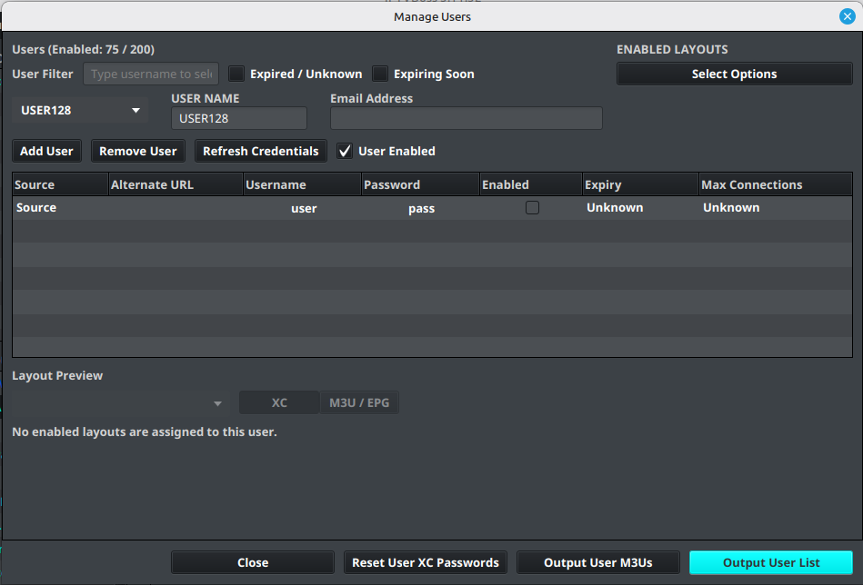

# Desktop Output Users

IPTVBoss uses layouts and user records to create separate output links for different customers, household members, or devices.

## Use one source per provider

For each provider, add one source to IPTVBoss, regardless of how many users have accounts with that provider.

For example, if several users have accounts with Provider A:

1. Add Provider A once using the provider credentials for the source.
2. Open **User Management**.
3. Add each customer or account as a separate IPTVBoss user.
4. Add that user's Provider A username and password to the Provider A credential entry.
5. Enable the user and the source credential.
6. Assign the user's enabled layout. In the layout manager, an enabled layout is shown in blue.
7. Repeat the process for each additional user of Provider A.

Repeat the source setup only when you have another provider. Do not create duplicate source entries for every user of the same provider unless there is a specific reason to keep the sources separate.

## User output links

Each enabled user receives their own M3U link. Standard EPG output can be shared between users when the guide data is the same. XC Server users receive unique XMLTV links.

[Universal EPG](../setup/universal-epg.md) is often more efficient when every user uses the same EPG data. It allows IPTVBoss to publish one shared EPG file instead of generating multiple identical EPG files for separate users or layouts.

!!! warning
    Do not include provider usernames, passwords, M3U links, EPG links, or access tokens in screenshots or support requests.

## Manage users

1. Open the **Sources** menu.
2. Select **Manage Users**.
3. Add or select a user.
4. Set **User Enabled** when the user should receive output.
5. Assign only layouts that are enabled.
6. Review the source credentials and enable the credentials the user should use.
7. Save the user and verify the generated links.

For browser-based administration, use [XC Server Users](../server/console/users.md). Server-side changes can trigger backups or cloud synchronization, so wait for the operation to finish before making another database change.

!!! note
    If desktop user management is locked or unavailable, check the account plan and whether another IPTVBoss process is currently modifying users.
