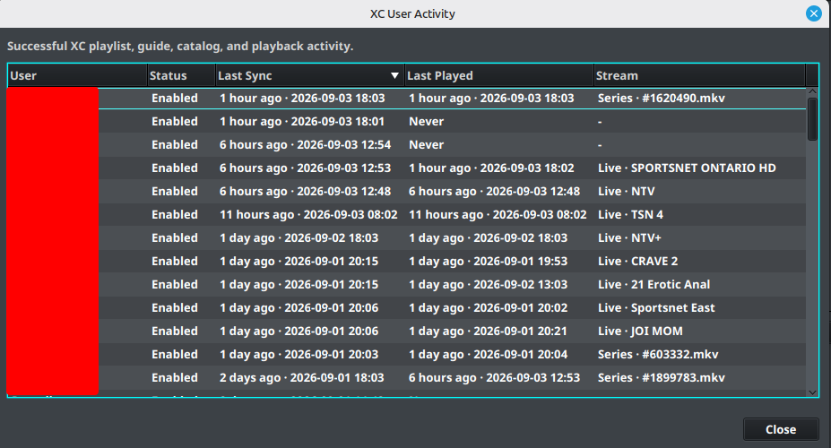

# Desktop Output Users

IPTVBoss uses layouts and user records to create separate output links for different customers, household members, or devices.

## Manage users

1. Open the **Sources** menu.
2. Select **Manage Users**.
3. Add or select a user.
4. Set **User Enabled** when the user should receive output.
5. Assign only layouts that are enabled.
6. Review the source credentials and enable the credentials the user should use.
7. Save the user and verify the generated links.

When XC Server pairing is enabled, the selected user can show an **XC Activity** summary with the last successful synchronization, last playback, and stream. Select **Activity** to open the full activity table for all users.

The activity view reports successful XC playlist, guide, catalog, and playback activity. **Last Sync** and **Last Played** use relative and exact timestamps; **Stream** identifies the most recently played live, VOD, or series item when that information is available. Activity is read from the paired XC Server, so it is unavailable until the desktop installation is paired and the server can be reached.

!!! important "Use one source per provider"
    Add each provider once, regardless of how many users have accounts with that provider. Store each user's provider credentials in that user's record instead of creating a duplicate source for every account.

## Understand provider credentials

For example, when several users have accounts with Provider A:

1. Add Provider A once using the provider credentials for the source.
2. Open **User Management**.
3. Add each customer or account as a separate IPTVBoss user.
4. Add that user's Provider A username and password to the Provider A credential entry.
5. Enable the user and the source credential.
6. Assign the user's enabled layout. In Layout Manager, an enabled layout is shown in blue.
7. Repeat the user steps for each additional account.

Repeat the source setup only when adding another provider. Create separate source entries for the same provider only when there is a specific reason to manage them independently.

## User output links

Each enabled user receives their own M3U link. Standard EPG output can be shared between users when the guide data is the same. XC Server users receive unique XMLTV links.

PRO [Universal EPG](../setup/universal-epg.md) is often more efficient when every user uses the same EPG data. It allows IPTVBoss to publish one shared EPG file instead of generating multiple identical EPG files for separate users or layouts.

PRO For browser-based administration in the 3.12 Beta workflow, use [XC Server Users](../server/console/users.md). Server-side changes can trigger backups or cloud synchronization, so wait for the operation to finish before making another database change.

!!! warning
    Do not include provider usernames, passwords, M3U links, EPG links, or access tokens in screenshots or support requests.

!!! note
    If desktop user management is locked or unavailable, check the account plan and whether another IPTVBoss process is currently modifying users.
