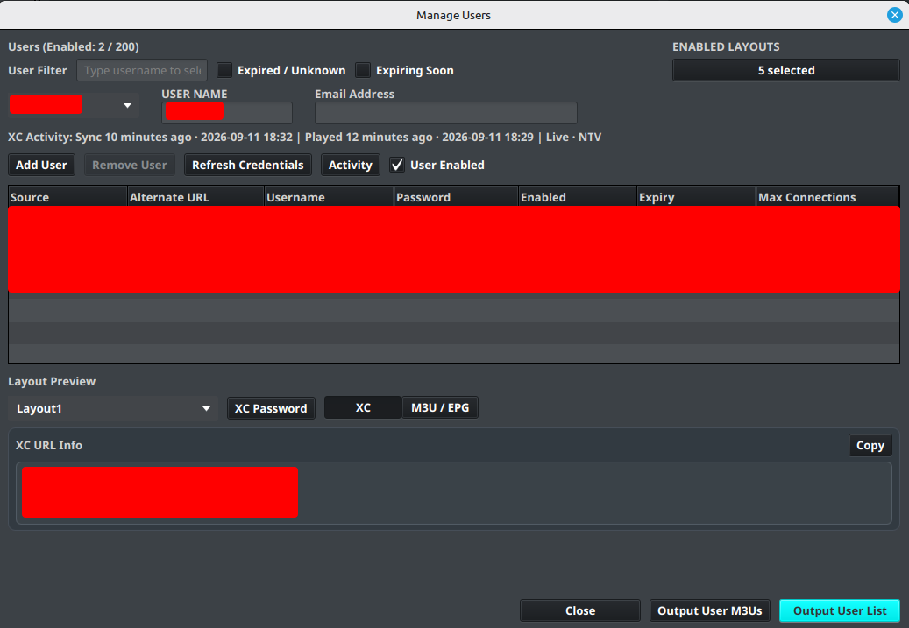
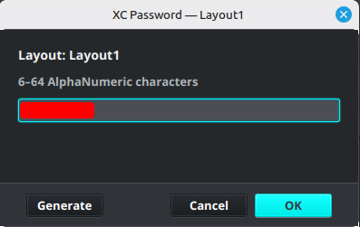

# Desktop Output Users

IPTVBoss uses layouts and user records to create separate output links for different customers, household members, or devices.

## Manage users

1. Open the **Sources** menu.
2. Select **Manage Users**.
3. Add or select a user.
4. Set **User Enabled** when the user should receive output.
5. Assign only layouts that are enabled.
6. Review the source credentials and enable the credentials the user should use.
7. Save the user and verify the generated links.

!!! important "Use one source per provider"
    Add each provider once, regardless of how many users have accounts with that provider. Store each user's provider credentials in that user's record instead of creating a duplicate source for every account.

## Understand provider credentials

For example, when several users have accounts with Provider A:

1. Add Provider A once using the provider credentials for the source.
2. Open **User Management**.
3. Add each customer or account as a separate IPTVBoss user.
4. Add that user's Provider A username and password to the Provider A credential entry.
5. Enable the user and the source credential.
6. Assign the user's enabled layout. In Layout Manager, an enabled layout is shown in blue.
7. Repeat the user steps for each additional account.

Repeat the source setup only when adding another provider. Create separate source entries for the same provider only when there is a specific reason to manage them independently.

## Refresh provider expiry

Select a user in **Manage Users**, then choose **Refresh Credentials**. IPTVBoss checks the user's enabled Xtream Codes credentials and password-backed M3U credentials whose source has an XC URL. It uses the credential's alternate provider URL when one is configured.

The button shows **Refreshing…** while requests run in the background. The Manage Users dialog is temporarily disabled and cannot be closed until the refresh finishes. Review **Provider refresh results** for the result from each supported source.

| Result | Effect on saved values |
| --- | --- |
| Expiry refreshed or unchanged | The provider confirmed the expiry; any supplied connection limit is updated. |
| Provider omitted expiry | The previous expiry is kept and the supplied connection limit is updated. |
| Login rejected | Expiry and connection limit become unknown. Check the provider credentials. |
| Rate limit, failed request, or invalid data | Previous values are kept. For a rate limit, try later; for a failed request, review the IPTVBoss log. |

**Disable NoGUI user checks** does not block manual refresh. For scheduled checks and their request limits, see [Automatic NoGUI user checks](../settings/automation.md#automatic-nogui-user-checks).

## XC account expiry

The expiry shown in desktop XC login details and returned to XC players is calculated for the selected layout. IPTVBoss considers enabled credentials used by enabled channels the user can access in that layout's enabled live, VOD, and series groups, including linked groups. Credentials for unrelated sources are excluded.

When every relevant credential has a known expiry date, the account expiry is the **latest** of those dates. For example, if two providers in the layout expire on September 20 and October 10, the XC account reports October 10. Each provider still has its own expiry; this does not extend access to the earlier-expiring provider.

If any relevant credential has an unknown or unlimited expiry, or no credentials qualify, desktop login details show **No account expiry** and the XC API returns a null expiry. This describes the account metadata; it does not guarantee that an individual provider login is valid.

## XC passwords and activity

Each assigned XC-enabled layout has its own XC login password for this user. Select the layout in **Layout Preview**, then choose **XC Password** to edit the saved password or generate a new one. Passwords are case-sensitive; manual values may contain 6–64 letters, digits, or `- . _ ~`, while **Generate** creates a new 12-character lowercase value. The action is available only for an XC-enabled layout.

When XC Server pairing is enabled, the selected user can show an **XC Activity** summary with the last successful synchronization, last playback, and stream. Select **Activity** to open the full activity table for all users.

The activity view reports successful XC playlist, guide, catalog, and playback activity. **Last Sync** and **Last Played** use relative and exact timestamps; **Stream** identifies the most recently played live, VOD, or series item when that information is available. Activity is read from the paired XC Server, so it is unavailable until the desktop installation is paired and the server can be reached.

## User output links

Each enabled user receives their own M3U link. Standard EPG output can be shared between users when the guide data is the same. XC Server users receive unique XMLTV links and a separate XC username/password pair for each assigned XC-enabled layout. Changing a layout password changes access to that layout; refresh or redistribute the affected link after saving.

PRO [Universal EPG](../setup/universal-epg.md) is often more efficient when every user uses the same EPG data. It allows IPTVBoss to publish one shared EPG file instead of generating multiple identical EPG files for separate users or layouts.

PRO For browser-based administration in the 3.12 Beta workflow, use [XC Server Users](../server/console/users.md). Server-side changes can trigger backups or cloud synchronization, so wait for the operation to finish before making another database change.

!!! warning
    Do not include provider usernames, passwords, M3U links, EPG links, or access tokens in screenshots or support requests.

!!! note
    If desktop user management is locked or unavailable, check the account plan and whether another IPTVBoss process is currently modifying users.

Continue with [Connect a Player](../setup/connect-player.md). For credential maintenance, see [automatic NoGUI user checks](../settings/automation.md#automatic-nogui-user-checks) and [Email Notifications](../settings/email.md).
