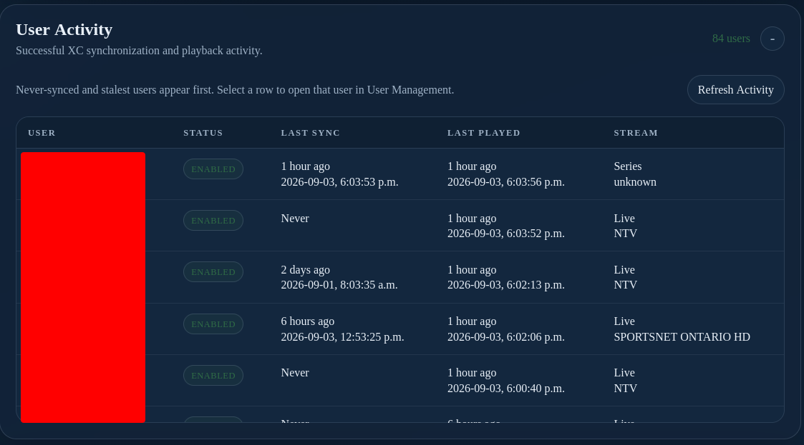

# XC Server User Activity

--8<-- "includes/xc-server-preview.md"

Use **User Activity** to review the latest successful activity recorded by the XC Server for each user. The section is read-only and does not require console editing access.

The table reports:

- **User** — the configured XC user.
- **Status** — whether the user is enabled.
- **Last Sync** — the latest successful playlist, guide, or catalog synchronization.
- **Last Played** — the latest successful playback request.
- **Stream** — the most recently played live, VOD, or series item when available.

Users who have never synchronized, or whose synchronization is oldest, appear first so stale accounts are easy to identify. Select a row to open that user in **User Management**, then use [XC Server Users](users.md) to review layouts, credentials, and output links.

Select **Refresh Activity** to request the latest activity from the server. If the table is empty or unavailable, confirm that the server is running, the desktop or browser session is authenticated, and the server has recorded successful requests. Failed requests are not presented as successful activity.

!!! warning
    Activity timestamps and stream names can identify users and viewing behavior. Treat the activity view as private administrative information and redact it before sharing screenshots.
