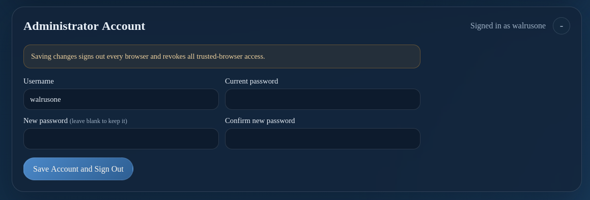

# Server Console: Administrator Account

--8<-- "includes/xc-server-preview.md"

The **Administrator Account** section changes the username or password used to sign in to the Server Console.

1. Open **Account** or **Administrator Account**.
2. Enter the current password.
3. Enter the new username or password and confirm the password when changing it.
4. Save the account change.
5. Sign in again with the new credentials if the console ends the current session.

Changing the administrator password does not replace the section PIN or authenticator settings. Update stored credentials only after confirming the new login works.
