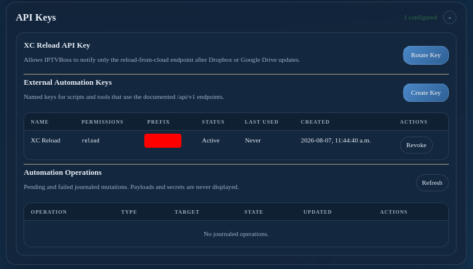

# Server Console: API Keys

The **API Keys** section lists the reload-only credentials created for paired IPTVBoss clients and the named keys used by scripts that call the documented `/api/v1` endpoints. These are separate credential types with different permissions.

## Paired reload credentials

The server creates a client-specific reload credential automatically during pairing. The desktop client uses it to request a server reload after its shutdown backup workflow completes. It cannot be used for general administration or external automation.

Manage this access through [Paired Devices](paired-devices.md). Revoking a paired client also revokes its reload credential. If a credential is rejected but the pairing is still valid, the client attempts to refresh the credential and retry once. Normally, users do not need to copy or configure these credentials manually.

See [Automatic server reloads from this client](../gui-settings.md#automatic-server-reloads-from-this-client) for the user-facing workflow.

## External Automation Keys

1. Select **Create Automation Key**.
2. Enter a descriptive name and, when appropriate, an expiry date.
3. Select the required permissions or scopes.
4. Create the key and copy the secret immediately.
5. Store it in the script or secret manager that will use it.

The console shows key metadata, but not the complete secret after creation. Rotate a key when it may be compromised and revoke keys that are no longer needed. Do not put an API key in screenshots, source control, or support requests.

The **Automation Operations** area shows pending or failed journaled mutations. Use the operation status endpoint or the console status before retrying a request.
