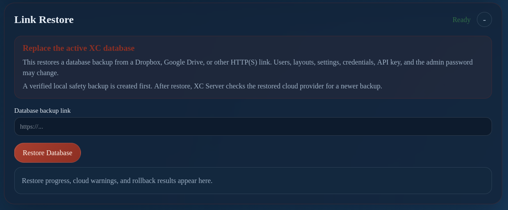

# Server Console: Link Restore

Use **Link Restore** to restore or initialize a server database from a supported link workflow.

In bootstrap mode, confirm which database will become authoritative before restoring. If the server is already paired, do not initialize a replacement database without owner approval.
