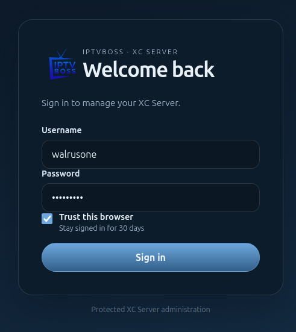

# Server Console: Login and Setup

## First-time setup

When the server has no administrator account, the console displays the setup form.

1. Enter the administrator username.
2. Enter and confirm a strong password.
3. Enter and confirm a six-digit section PIN.
4. Save the setup form and keep the credentials in a secure password manager.

The section PIN is separate from the administrator password. It protects sensitive sections after you sign in.

## Sign in

1. Open the server console URL.
2. Enter the administrator username and password.
3. If prompted, enter the current six-digit code from the authenticator app.
4. If the authenticator is unavailable, choose **Use a recovery code** and enter one unused recovery code.

Use **Log out** when finished on a shared computer. Never share the console URL, password, authenticator secret, or recovery codes.
