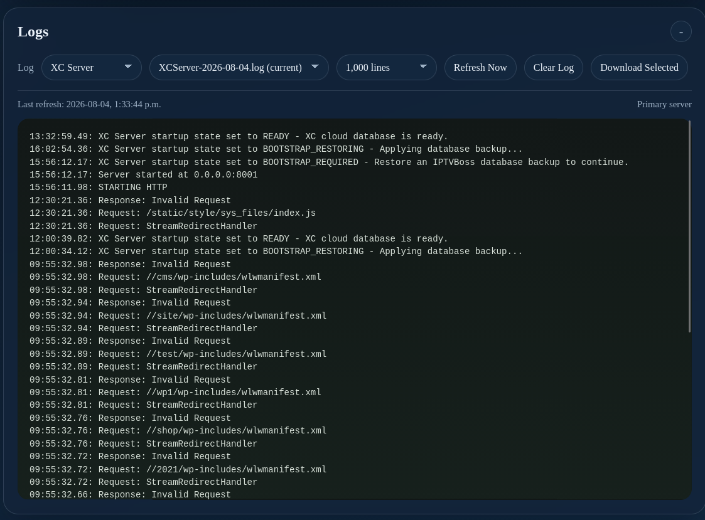

# Server Console: Logs

Use **Logs** to review server activity, synchronization results, output events, and failures.

Review the timestamp and operation before repeating a failed action. Include the relevant log entries, application version, and server mode when requesting support, but redact API keys and passwords.
