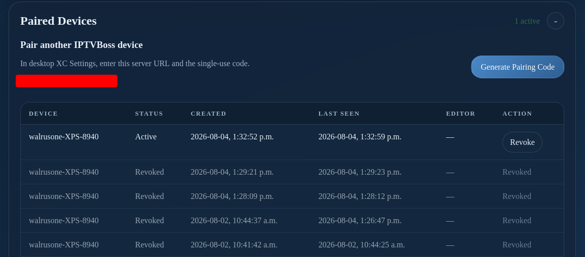

# Server Console: Paired Devices

Use **Paired Devices** to generate a single-use pairing code, review connected clients, and revoke access for a device that should no longer reach the server. Pairing also provisions the client-specific credential that allows an IPTVBoss desktop installation to request an automatic server reload after its shutdown backup finishes.

1. Select **Generate Pairing Code**.
2. Enter the displayed server URL and single-use code in the other IPTVBoss desktop installation's XC Settings.
3. Wait for the device to appear in the paired-device table.
4. Use **Revoke** for a device that should no longer connect.

The code expires and should be shared only with the intended device owner. The reload credential is limited to requesting a server reload; it does not grant general Server Console access. Revoking a device also revokes its reload credential and releases its editor lease when applicable. A revoked client can no longer trigger automatic reloads unless it is paired again.

Treat pairing and recovery codes as temporary credentials; do not publish them. For the complete client-triggered workflow, see [Automatic server reloads from this client](../gui-settings.md#automatic-server-reloads-from-this-client).
