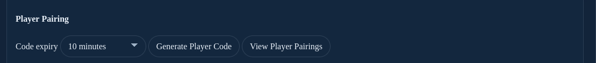
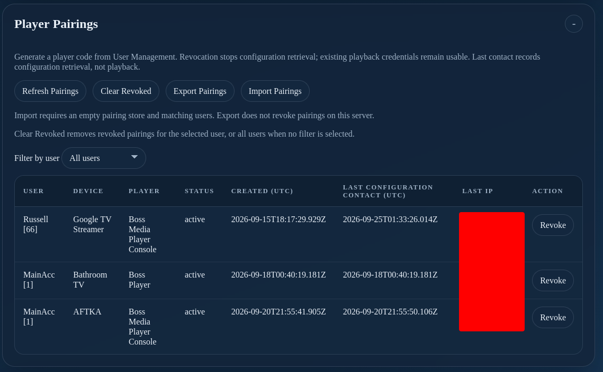

# XC Player Pairing (Beta)

--8<-- "includes/xc-server-pro.md"

!!! warning "Beta feature — IPTVBoss 3.12.6"
    XC Player Pairing is in beta and requires a compatible beta player. Ordinary Xtream Codes players can continue using [XC login details](../../setup/connect-player.md#xc-server-login).

Player pairing gives a compatible player the user's assigned XC layouts, layout credentials, and guide links through a single-use code. The player can retrieve the current configuration again after pairing.

Use **User Management → Player Pairing** for players. [Paired Devices](paired-devices.md) connects IPTVBoss desktop installations for administration and database synchronization; its codes are separate.

## Before generating a code

1. Complete [First XC Server Connection](../first-connection.md) with Pro active.
2. Confirm the configured player-facing server address is reachable from the player's network. Use the server address, not the `/boss.php` console address.
3. In [User Management](users.md), enable the intended user and assign the enabled layouts they should receive.
4. Enable **XC Enabled** on those layouts and check the user's required provider credentials.
5. Unlock the console sections with the section PIN when prompted. Finish pending database setup, restores, or synchronization before retrying an unavailable pairing action.

## Generate and share a player code

1. Open **User Management** and select the intended user.
2. Find **Player Pairing** in the selected-user summary.
3. Choose **Code expiry**: **10 minutes** (the default), **30 minutes**, **1 hour**, or **24 hours**.
4. Select **Generate Player Code**.
5. Copy the code and, when needed, the displayed server URL for the intended player owner.

When discovery is available, supported players can use just the code. If the result says **Server discovery is unavailable**, give the player owner both the **Server URL** and **Code**. A compatible player that does not support discovery also needs both values.

The result shows the expiry in UTC. The code expires when used or when its time limit is reached. Generating a new code replaces that user's previous unused code. Generate a separate code for each additional player.

Keep codes, server credentials, and pairing exports private. Never use the administrator password or a desktop pairing code as a player code.

## Review and revoke pairings

Select **View Player Pairings** from the user summary, or open **Player Pairings** in the console.

| Control or field | Purpose |
| --- | --- |
| **Refresh Pairings** | Reloads the list. |
| **Filter by user** | Shows one user's pairings or all users. |
| **Status** | Identifies active or revoked pairings. |
| **Last Configuration Contact (UTC)** | Shows the last configuration retrieval, not the last playback. |
| **Revoke** | Stops that pairing from retrieving configuration again. |
| **Clear Revoked** | Removes revoked records for the selected user, or all users when no user filter is selected. |

!!! important "Revocation and playback"
    Revoking a pairing does not invalidate XC credentials already supplied to the player. To change playback access, also review the user's access and [layout passwords](users.md). Pair again with a new code when configuration access should be restored.

## Export and import pairings

Use **Export Pairings** to save the pairing store for a server transfer. Keep the export private because it contains pairing access data. Exporting leaves the source server's pairings active.

On the destination, restore the corresponding users and configuration first. **Import Pairings** requires an empty pairing store and matching users; it does not merge into an existing store. Importing pairings does not itself change the server address saved in a player. Ensure the intended address reaches the destination before testing retrieval, and retire access to the old server as appropriate.

## Verify and troubleshoot

1. Ask the player owner to use the code before it expires, then refresh the pairing list.
2. Confirm the expected user and device appear as active.
3. Have the player retrieve its configuration and confirm the expected layouts and guide data.
4. Test a channel. Use [User Activity](activity.md) for playback activity.

If a code is expired or already used, generate a new one. If discovery is unavailable, use the displayed server URL with the code. If the configuration is unavailable during a server update or restore, wait for that operation to finish and retry. For missing layouts or playback failures, review user assignments, XC output, provider credentials, and [XC Server Troubleshooting](../troubleshooting.md).
