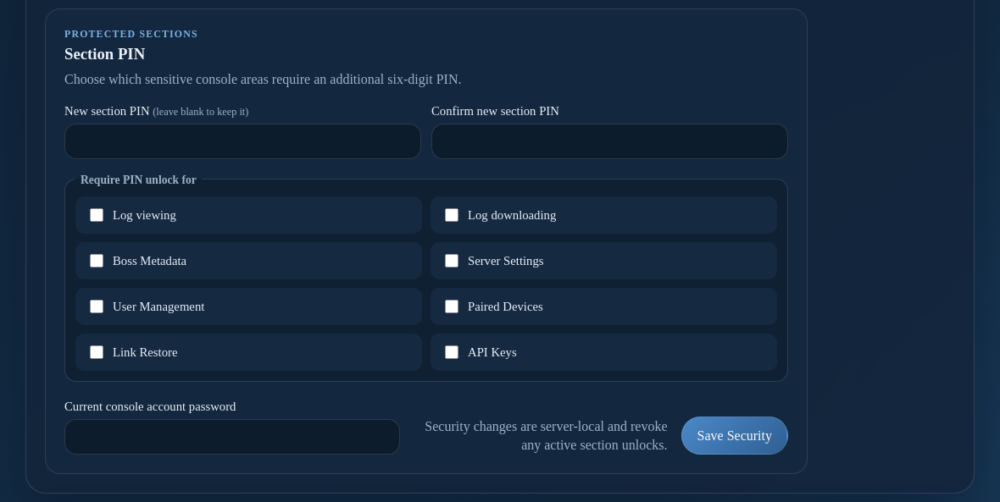
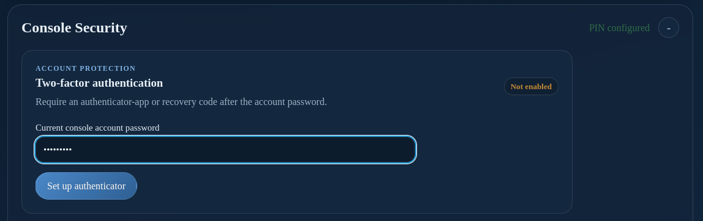
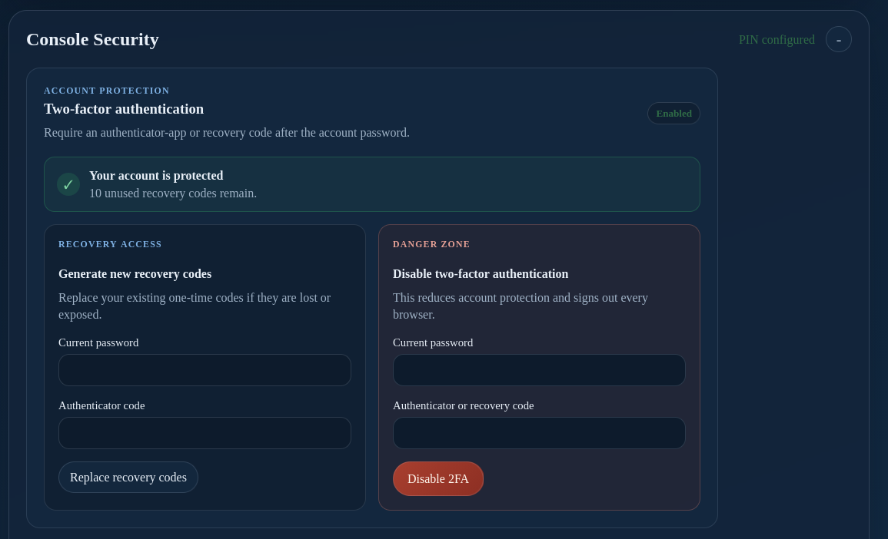

# Server Console: Security

**Console Security** controls two-factor authentication and which console sections require an additional six-digit PIN.

## Authenticator two-factor authentication

1. Open **Console Security** → **Two-factor authentication**.
2. Enter the current administrator password.
3. Scan the QR code with an authenticator app, or enter the displayed manual key.
4. Enter the current six-digit authenticator code to confirm enrollment.
5. Save the recovery codes in a secure location before closing the recovery-code panel.

Recovery codes are one-time credentials. Generate a new set if the codes may have been copied; the previous set stops working. Disable two-factor authentication only when necessary and only after confirming the account remains protected by a strong password.

## Section PIN protection

The section PIN must contain exactly six digits. Use the security settings to choose which areas require PIN unlock:

- Log viewing and log downloading
- Boss Metadata
- Server Settings
- User Management
- Paired Devices
- Link Restore
- API Keys

Security changes revoke active section unlocks. Re-authenticate with the new PIN when a protected section requests **PIN Unlock**.

Keep the administrator password and section PIN separate. Do not publish either credential.
