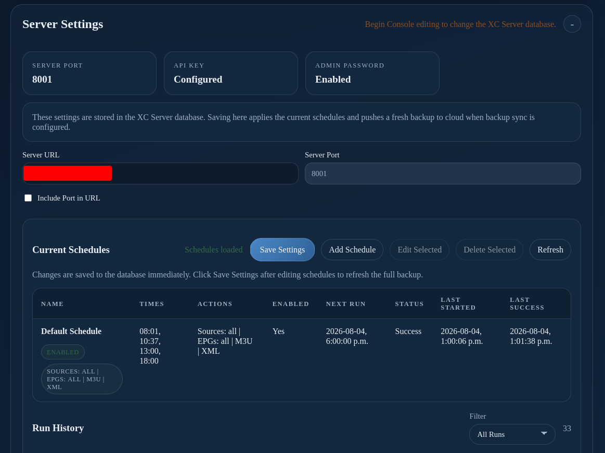

# Server Console: Server Settings

Use **Server Settings** in the web frontend to configure server connection details and schedules.

1. Enter the server address in **Server URL**.
2. Enter the listening port in **Server Port**.
3. Enable **Include Port in URL** when the public address requires it.
4. Review the displayed connection address.
5. Select **Save Settings**.

Use an address reachable by paired desktop installations. Do not use `localhost` or `127.0.0.1` when another computer must connect.

## Current Schedules

1. Select **Add Schedule**.
2. Choose source synchronization, EPG synchronization, M3U output, or XML output.
3. Choose the run times and enable the schedule.
4. Select **Save Settings**.
5. Confirm the schedule’s next run and status.

Use **Edit Selected**, **Delete Selected**, and **Refresh** only after confirming the intended schedule.
