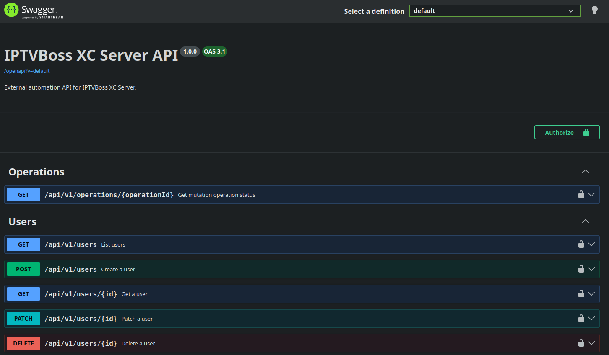

# Server Console: Swagger API Documentation



The server exposes interactive Swagger documentation for the external API at:

```text
https://server.example/swagger
```

After signing in to the console, open the **Swagger** link or the server's `/swagger` path. The documentation session is separate from an external automation API key; use a valid key when testing an endpoint that requires one.

The documented API includes user metadata, user listing and mutations, password reset, and asynchronous operation status. Treat the **Try it out** controls as live operations: use a test user and confirm the target server before sending a request.
