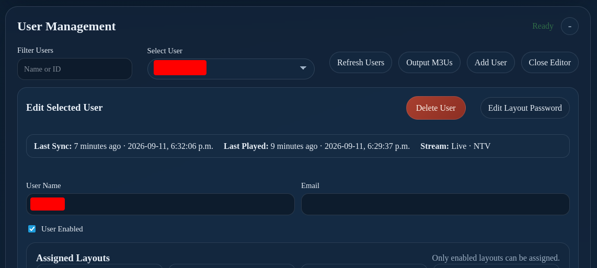
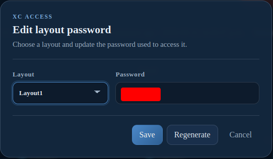

# XC Server Users

--8<-- "includes/xc-server-preview.md"

Use **User Management** to control users whose layouts, source credentials, and output links are managed through the XC Server. Changes require console editing access and may be unavailable while another editor or synchronization process owns the database.

## Open User Management

1. Open the Server Console.
2. Unlock editing with the required administrator access.
3. Open **User Management**.

The selected-user summary can include the user's last successful synchronization, last playback, and current stream. See [User Activity](activity.md) for the server-wide activity table.

## Add or edit a user

1. Select **Add User** to create a user, or select an existing user.
2. Enter the **User Name** and optional **Email**.
3. Enable **User Enabled** when the user should receive output.
4. Assign one or more enabled layouts.
5. Add or update the user's source credentials.
6. Save the changes.
7. Wait for any backup or cloud-sync operation to finish.

Both the user and the assigned source credentials must be enabled. The assigned layout must also be enabled before output is expected.

Each assigned XC-enabled layout has its own XC login password. In **Edit User**, select **Edit Layout Password**, choose the layout, then either save a 6–64-character password (`A-Z`, `a-z`, `0-9`, `-`, `.`, `_`, or `~`) or select **Regenerate** for a new 12-character lowercase password. Passwords are unique across a user’s layouts and changing one affects only that layout’s XC access.

## Output and access actions

- Use **Output M3Us** to generate or review user playlist output.
- Use **Edit Layout Password** to change or regenerate the password for one assigned XC-enabled layout.
- Use **Delete User** only after confirming that no player, layout, or customer still depends on the account.

!!! warning
    Changing a layout password changes access for that layout. Deleting a user can remove access to assigned outputs. Confirm the intended user and layout before either action.

## Verify a server user

1. Confirm the user is enabled.
2. Confirm the assigned layout is enabled.
3. Confirm the source credentials are present and enabled.
4. Confirm the generated M3U link.
5. Confirm the XMLTV link when XC Server output is used.
6. Review server logs after saving changes.

Server changes affect the shared authoritative database. Do not edit the same users from another IPTVBoss or XC Server process at the same time.

See [provider credentials](../../layouts/users.md#understand-provider-credentials) for the shared source/user model, then [Connect a Player](../../setup/connect-player.md) to test delivery.
