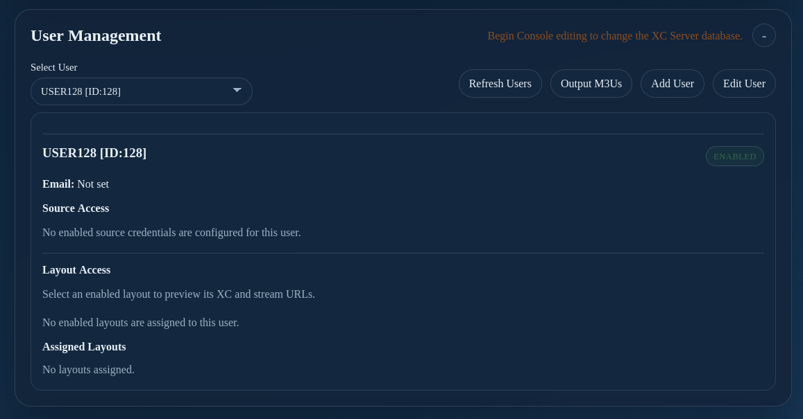

# Server Console: User Management

Use **User Management** to review and manage users whose layouts, source credentials, and output links are provided through the XC Server. User mutations require console editing access and may be unavailable while another editor or synchronization process owns the database.

Confirm the intended user, assigned layout, and source credentials before saving changes. User changes affect the shared server database and can change output for paired clients. Wait for the save and backup status to complete before making another mutation.
