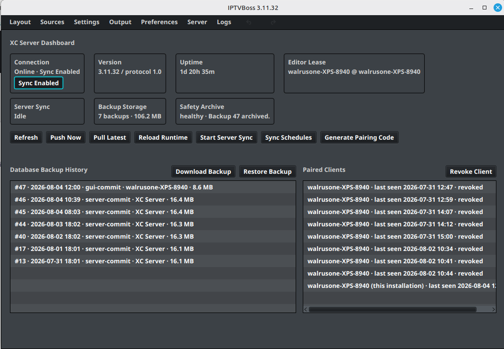

# GUI Server Dashboard

💲 [Pro feature — see Free vs Pro](../getting-started/free-vs-pro.md).

The **GUI Server Dashboard** is the dashboard shown inside the desktop IPTVBoss application when the XC Server is enabled. Open it from the **Server** menu in the GUI.

The dashboard provides a quick view of the server’s current state and controls for common server operations:

- **Connection** shows whether the server is online and whether synchronization is enabled.
- **Version**, **Uptime**, and **Editor Lease** identify the running server and the active editor connection.
- **Server Sync**, **Backup Storage**, and **Safety Archive** show synchronization and backup status.
- **Refresh**, **Push Now**, **Pull Latest**, and **Reload Runtime** refresh or reconcile server state.
- **Start Server Sync** and **Sync Schedules** control synchronization operations.
- **Generate Pairing Code** creates a temporary code for connecting another IPTVBoss installation.
- **Database Backup History** lists available backups and provides **Download Backup** and **Restore Backup** actions.
- **Paired Clients** lists connected installations and provides **Revoke Client**.

Review the connection, sync, and backup status before starting a server operation. A restore or push can affect the authoritative database and every paired installation.

For the browser-based administration interface, use the [Server Console](index.md) and its [Console Sections](index.md#console-overview).
