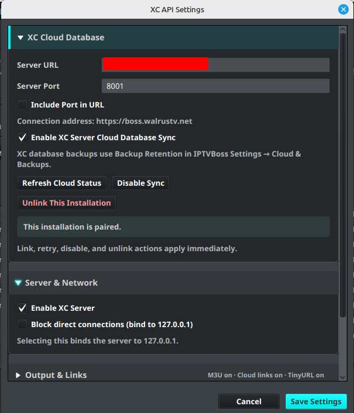
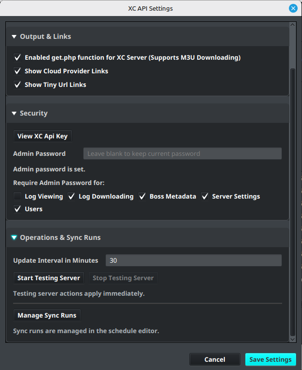

# Desktop GUI Settings

Open **Settings** → **Server Settings** in the desktop IPTVBoss application. These settings connect the desktop installation to the XC Server and control its server, network, output, security, and synchronization behavior.

## XC Cloud Database

1. Enter the **Server URL** and **Server Port**.
2. Enable **Include Port in URL** when required by the public address.
3. Review the displayed connection address.
4. Link the installation before enabling cloud database synchronization.

After pairing, actions such as **Refresh Cloud Status**, **Disable Sync**, **Retry Current Database**, and **Unlink This Installation** apply immediately.

## Server and Network

Use **Enable XC Server** when this installation should provide the XC Server service. Use **Block direct connections (bind to 127.0.0.1)** only when the server must be local-only; it prevents remote paired devices from reaching it.

Enabling the XC Server does not require any layout to be enabled for XC output. The server can be used solely to deliver M3U playlists. Enable **XC Enabled** on a layout only when that particular layout should participate in XC Server output.

## Output, links, security, and operations

- **Output and Links** controls M3U downloads, cloud-provider links, and TinyURL links. Enable only the link types required by the deployment.
- **Security** controls the administrator password and which console areas require administrator protection.
- **Operations and Sync Runs** contains the update interval, testing-server controls, and **Manage Sync Runs**. Use these only when you understand their effect on the shared server.

!!! warning
    Never publish an administrator password, API key, pairing code, or private server address.
