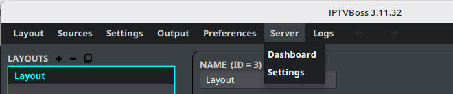
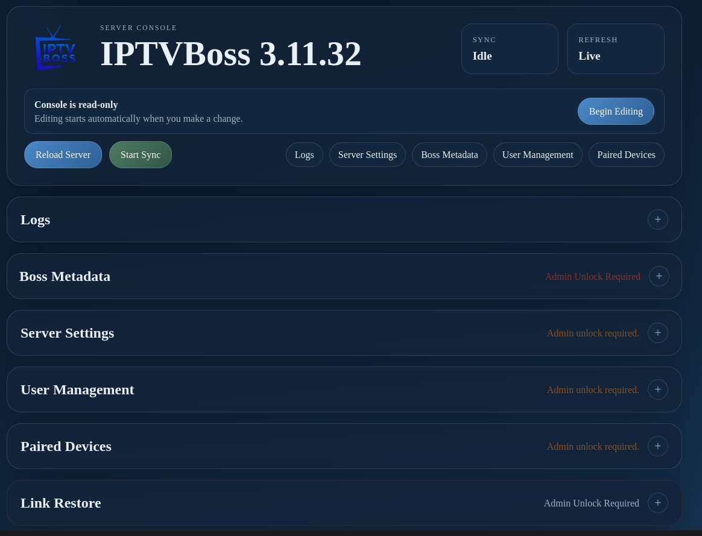
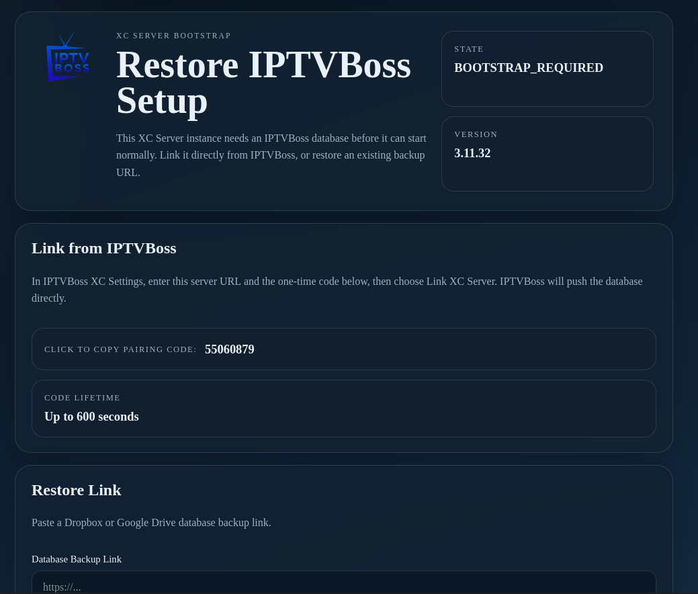

# Server Overview

The IPTVBoss XC Server provides a central database, scheduled synchronization, output generation, and access for paired IPTVBoss devices. It is intended for supported users who need a server or headless workflow.

!!! warning
    Server operations can change the authoritative database and output for every paired device. Create a backup and confirm the intended server before editing.

## Open the Server Console

1. Open the **Server** menu.
2. Select **Dashboard**.
3. Review the server version, synchronization status, refresh status, and current mode.
4. Select **Reload Server** when you need to refresh the displayed server state.

The console is read-only until you select **Begin Editing**. Editing controls are protected because server changes affect the shared database.

## Console sections

The console can provide these sections:

- **Logs** — Review server activity and failures.
- **Boss Metadata** — Review server metadata and administrative information.
- **Server Settings** — Configure the server URL, port, and schedules.
- **User Management** — Review or manage server users.
- **Paired Devices** — Generate pairing codes and revoke device access.
- **Link Restore** — Restore or initialize a server database from a supported link workflow.

Some sections require an administrator unlock before they can be opened.

## Start a server sync

1. Confirm that the intended local database has been backed up.
2. Confirm that no other editor is making changes.
3. Select **Start Sync**.
4. Wait for the synchronization status to return to an idle or successful state.
5. Review the result in **Logs**.

Do not close the application or edit the database while a server sync is in progress.

## Pair another device

1. Open **Paired Devices**.
2. Select **Generate Pairing Code**.
3. In the desktop IPTVBoss installation, open **Server Settings**.
4. Enter the server URL and single-use pairing code.
5. Complete the pairing process.
6. Return to **Paired Devices** and confirm that the device is active.

Revoke a device when it should no longer access the server. Treat pairing codes as temporary credentials and do not publish them.

## Server bootstrap and restore

When the server has no usable database, it may enter bootstrap mode and require a database restore before it can continue.

Use the documented restore path and confirm which database will become authoritative. If the server is already paired, do not initialize a replacement database without owner approval.

!!! note
    Server console sections and labels may change between releases.
