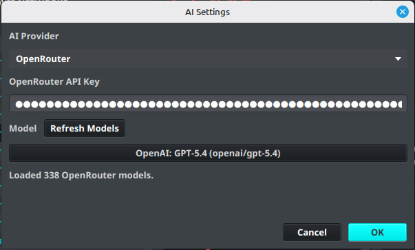

# AI Settings

AI Settings configure the provider and model used by IPTVBoss [AED AI Regex Assistance](../features/aed.md).

## Configure an AI provider

1. Open **Settings**.
2. Select **AI Settings**.
3. Choose an **AI Provider**.
4. Enter the provider API key.
5. Select a **Model**, or select **Refresh Models** after entering the key.
6. Select **OK** to save.

!!! warning
    API keys are sensitive credentials. Store them only in the application settings and never include them in screenshots, logs, or support requests.

## Troubleshoot model loading

If the model list cannot be refreshed:

1. Confirm that the selected provider is correct.
2. Confirm that the API key is valid and has permission to list or use models.
3. Check the network connection.
4. Review the IPTVBoss logs for the provider error.
5. Select a saved or default model when the provider catalog is unavailable.

AI-suggested regex remains advisory. Test the resulting AED against representative provider names before saving or applying it broadly.
