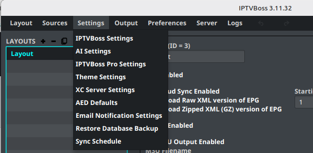
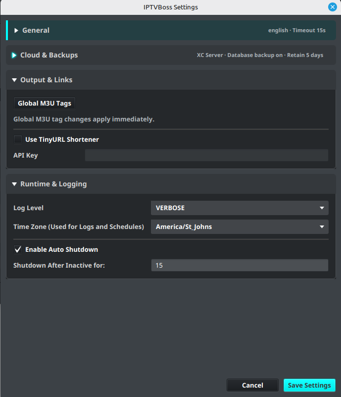

# Application Settings

Open **Settings** → **IPTVBoss Settings** to configure application-wide behavior. These settings affect more than one source or layout, so change them deliberately.

## General settings

Review the general section for settings such as:

- Language
- Network timeout
- User agent
- Automatic shutdown behavior

Use a timeout appropriate for the provider and network. A very short timeout can make a slow but working source appear to have failed.

## Backup and cloud settings

💲 Database cloud synchronization and backup controls are Pro features. [See Free vs Pro](../getting-started/free-vs-pro.md).

IPTVBoss can use cloud providers or an XC Server for database synchronization and backups. Available providers can include **Dropbox**, **Google Drive**, or **XC Server**, depending on account access and configuration.

Before enabling synchronization:

1. Confirm which database should be authoritative.
2. Confirm that you can access the selected provider.
3. Confirm the backup retention value.
4. Save the settings.
5. Verify the first backup before relying on it for recovery.

!!! warning
    Cloud synchronization is not a substitute for understanding which database is authoritative. Do not enable multiple competing sync workflows without a recovery plan.

See [Recovery and Application Files](../troubleshooting/recovery.md) before attempting a cloud restore, [Cloud Output Links](../setup/output-links.md) for generated links, and [Automatic Synchronization](automation.md) for a Windows noGUI schedule.

## Runtime and logging settings

The settings dialog includes log level and log time-zone controls. Leave the log level at the normal setting unless support asks for more detail. Set the log time zone to the zone used by the person reviewing the logs.

## Output links and tags

Advanced settings may include global M3U output tags and output-link behavior. Change these only when you understand how the receiving player uses the generated attributes.

## Save and verify

1. Review each changed value.
2. Select the dialog’s save or confirmation action.
3. Restart IPTVBoss if the setting requires a restart.
4. Test the affected source, layout, or output.

!!! note
    Never include application keys, client secrets, API keys, or account tokens in screenshots or support tickets.
