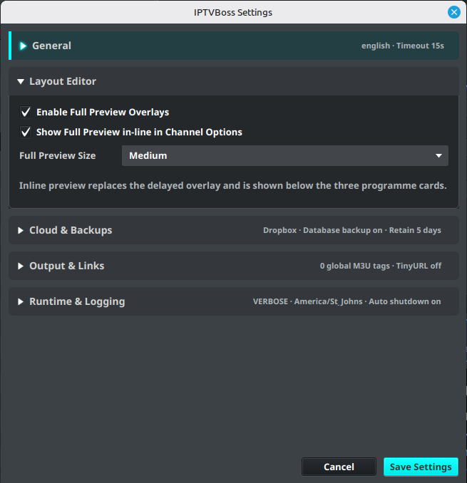
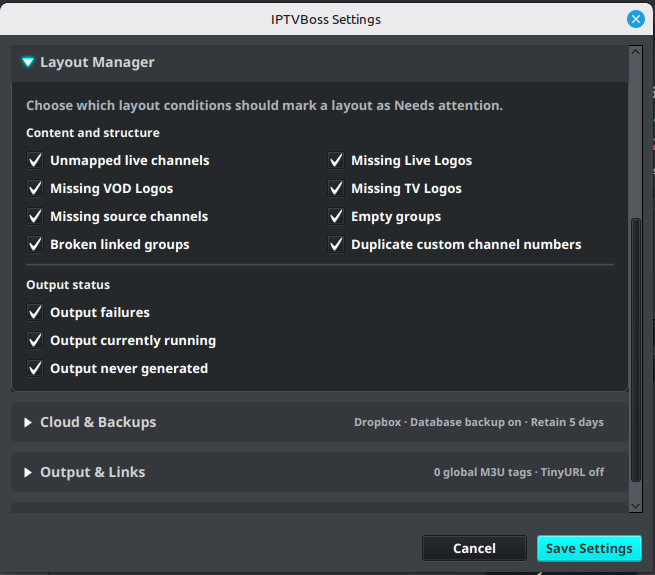

# Application Settings

Open **Settings** → **IPTVBoss Settings** to configure application-wide behavior. These settings affect more than one source or layout, so change them deliberately.

## General settings

Review the general section for settings such as:

- Language
- Network timeout
- User agent
- Automatic shutdown behavior

Use a timeout appropriate for the provider and network. A very short timeout can make a slow but working source appear to have failed.

## Backup and cloud settings

Use [Database Sync and Backups](backups.md) to preserve application data, choose the authoritative database, and configure backup retention. Database cloud synchronization and backup controls require Pro.

For playlist and EPG publishing, follow [Cloud Provider Setup](cloud-providers.md) and [Cloud Output Links](../setup/output-links.md).

## Runtime and logging settings

The settings dialog includes log level and log time-zone controls. Leave the log level at the normal setting unless support asks for more detail. Set the log time zone to the zone used by the person reviewing the logs.

## Output links and tags

Advanced settings may include global M3U output tags and output-link behavior. Change these only when you understand how the receiving player uses the generated attributes.

## Layout Editor settings

The **Layout Editor** section controls how programme previews appear while editing EPG mappings.

- **Enable Full Preview Overlays** enables the delayed full preview shown when hovering over a programme card.
- **Show Full Preview in-line in Channel Options** displays the selected programme preview below the three programme cards. When enabled, it replaces the delayed overlay.
- **Full Preview Size** sets the size of both the overlay and inline preview. Choose **Small**, **Medium**, or **Large**.

Save the settings, then reopen or refresh the Layout Editor if it was already open.

## Layout Manager attention checks

The **Layout Manager** section controls which conditions can mark a layout as **Needs attention**. All checks are enabled by default. Expand **Layout Manager** to review or change them, then select **Save Settings**.

The content and structure checks are **Unmapped live channels**, **Missing Live Logos**, **Missing VOD Logos**, **Missing TV Logos**, **Missing source channels**, **Empty groups**, **Broken linked groups**, and **Duplicate custom channel numbers**. The output checks are **Output failures**, **Output currently running**, and **Output never generated**.

These options change the health indicator and warning decision only. They do not disable output checks, remove channels, or repair a layout. See [Managing Layouts](../layouts/layout-manager.md#read-layout-health) for the dashboard values and clickable review workflow.

## Save and verify

1. Review each changed value.
2. Select the dialog’s save or confirmation action.
3. Restart IPTVBoss if the setting requires a restart.
4. Test the affected source, layout, or output.

!!! note
    Never include application keys, client secrets, API keys, or account tokens in screenshots or support tickets.
