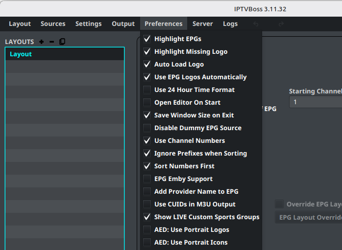
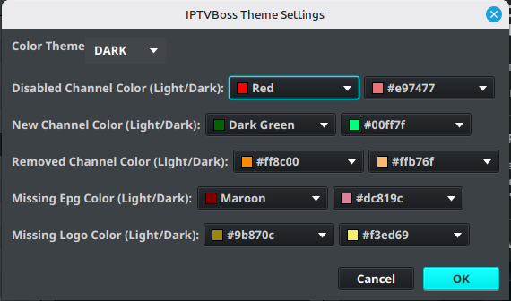

# Preferences and Theme

Use **Preferences** to control how IPTVBoss displays, sorts, and edits information. These options generally affect the current user interface rather than changing the source data itself.

## Common display preferences

Available preferences may include:

- Highlight channels missing EPG data.
- Highlight channels missing logos.
- Load logos automatically.
- Use EPG logos automatically.
- Use a 24-hour time format.
- Save the window size when IPTVBoss exits.
- Open the editor automatically at startup.

Enable one preference at a time when diagnosing an unexpected display change. This makes it easier to identify which option affected the result.

## Sorting and naming preferences

Preferences can also affect channel sorting and output naming, including:

- Ignoring prefixes while sorting.
- Sorting numbers first.
- Adding provider names to EPG output.
- Using channel numbers.
- Using CUIDs in M3U output.

Review these choices after importing a source and before generating output.

## Change the theme

1. Open **Settings**.
2. Select **Theme Settings**.
3. Choose the preferred theme.
4. Confirm the change.

Theme changes affect readability and may change the contrast of channel and error indicators. Review the layout editor and logs after changing themes.

## Restore expected behavior

If the interface behaves unexpectedly after changing preferences, return to the same menu and review the changed options. Record the previous values before resetting several options at once.
