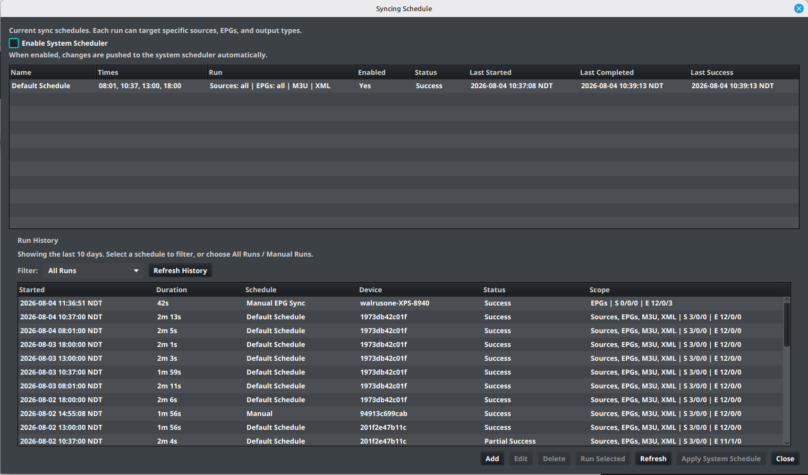
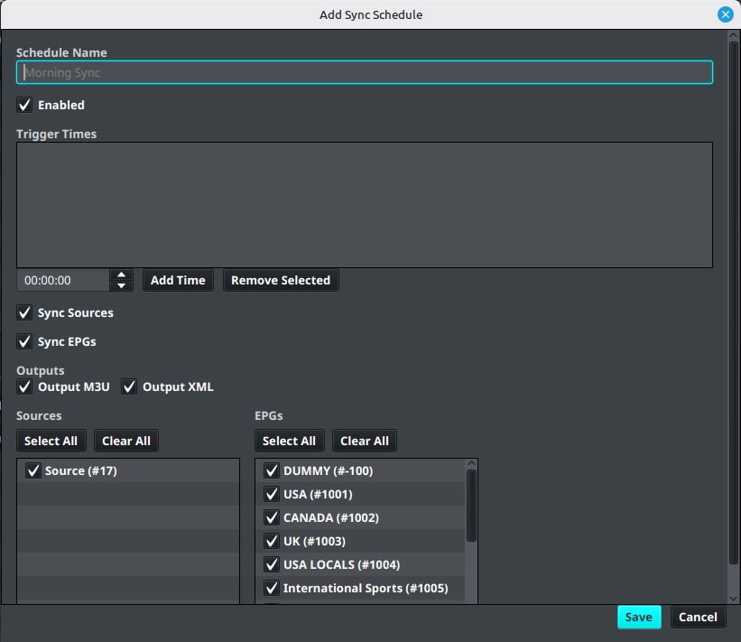

# Sync Schedule

The native **Sync Schedule** editor can run selected source synchronization, EPG synchronization, and output actions at configured times.

## Create a schedule

1. Open **Settings**.
2. Select **Sync Schedule**.
3. Select **Add**.
4. Enter a **Schedule Name**.
5. Add one or more **Trigger Times**.
6. Select the actions to run:
   - **Sync Sources**
   - **Sync EPGs**
   - **Output M3U**
   - **Output XML**
7. Select the sources and EPGs that the schedule should process.
8. Leave **Enabled** selected when the schedule should run automatically.
9. Select **Save**.

## Apply the system schedule

On supported desktop installations, enable **Enable System Scheduler** and select **Apply System Schedule**. This transfers the saved IPTVBoss schedule to the operating system scheduler.

Use **Run Selected** to test one schedule immediately. Use **Refresh** to reload the schedule table and recent run history.

## Review schedule history

The schedule table shows status and recent start/completion information. Select a schedule to filter its recent run history.

When a run fails:

1. Note the schedule name and start time.
2. Review the run status and failed action.
3. Open [Logs and Diagnostics](../troubleshooting/logs.md).
4. Confirm that the source or EPG can synchronize manually before changing the schedule.

!!! warning
    Do not create overlapping schedules that write to the same database at the same time. Choose one authoritative scheduler for a given installation.

For a Windows installation that cannot use the native scheduler, see [External noGUI Scheduling](automation.md).
