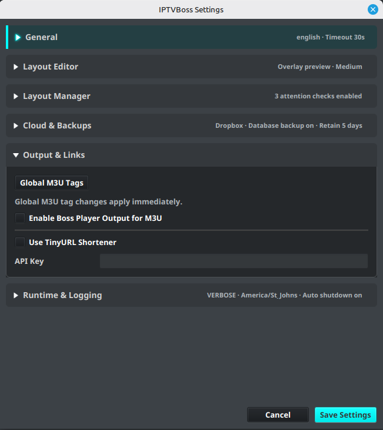
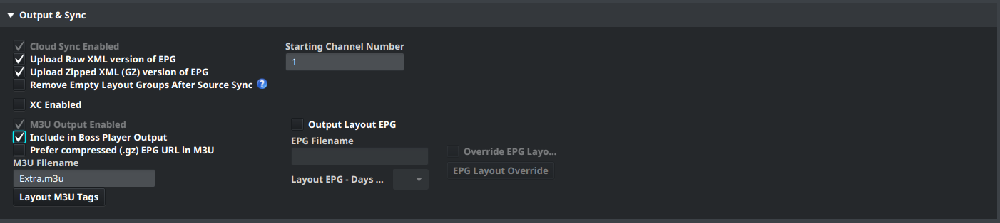

# Boss Player Output (Beta)

PRO [See Free vs Pro](../getting-started/free-vs-pro.md).

!!! warning "Beta feature — IPTVBoss 3.12.6"
    Boss Player Output is in beta and requires a compatible beta player that can import a Boss configuration URL. For ordinary M3U players, use the separate [playlist and XMLTV links](connect-player.md#m3u-and-xmltv).

Boss Player Output publishes one configuration URL per user. It collects that user's assigned Boss-enabled M3U layouts and available guide links so a compatible player can import and refresh them together. It uses Dropbox or Google Drive and does not require an XC Server or a player pairing code.

## Before enabling output

- Activate Pro and configure Dropbox or Google Drive through [Cloud Provider Setup](../settings/cloud-providers.md).
- Select and enable that provider for cloud output. Boss Player Output is unavailable when **XC Server** is selected as the database-sync provider; using Dropbox or Google Drive only for backups does not enable it.
- Prepare enabled layouts, saved EPG mappings, and [enabled users with provider credentials](../layouts/users.md). Explicitly assign each user the layouts they should receive.

## Enable Boss Player Output

1. Open **Settings → IPTVBoss Settings → Output & Links**.
2. Enable **Enable Boss Player Output for M3U** and select **Save Settings**. This preference defaults off, including on existing installations, and is locked without Pro.

    

3. Open **Layout Manager**, select an enabled layout, and expand **Output & Sync**.
4. Select **Include in Boss Player Output**, then save the layout. This checkbox appears when Pro and the global preference are enabled.
5. Repeat for each intended layout and confirm the user assignments in **Sources → Manage Users**.

    

Active Boss output keeps **M3U Output Enabled** and **Cloud Sync Enabled** selected. Configure layout EPG output or [Universal EPG](universal-epg.md) when the player should also receive a guide.

## Publish and copy the user's URL

1. Select **Output → All Layouts M3Us & EPGs** for the initial publication.
2. Wait for the complete output and upload operation to finish. Resolve any reported upload errors before sharing the URL.
3. Open **Sources → Manage Users**, select the user, and find **BOSS Player** in the preview area. Alternatively, open **Output → View Cloud Links** for the layout's user links.
4. Copy the user's Boss URL and hand it to the compatible beta player for configuration import.
5. Confirm the player receives the expected layouts, can play a channel, and has guide data where configured.

The direct cloud URL is available after successful publication. When TinyURL is configured and available, it is shown first and is the preferred copied URL; the direct link remains available. Keep either URL private because it provides the user's output configuration. A Boss URL is a configuration link, not an individual M3U or XMLTV link.

## Update layouts and guides

Generate output again after changing assignments, layout contents, or guide settings, then refresh the configuration in the player. GUI current-layout, all-layout, and per-user exports publish Boss output after their complete output batch. NoGUI runs also publish it when Pro, the global preference, and the required output options are enabled.

Each user's configuration describes their complete set of enabled, Boss-enabled, explicitly assigned layouts. Partial output runs reuse previously published links for untouched outputs from the same cloud account. This includes links published before Boss output was enabled. An initial full output run avoids missing-link failures on later partial runs.

A layout's published EPG is used when available, with the published universal guide as fallback. Raw XML and compressed XML (`.gz`) guides are supported. Boss output does not request extra EPG exports, so enable and generate the guide output you need. An EPG-only run can reuse existing published M3U links.

The per-user URL normally remains stable, including after a user rename. Changing the cloud provider, account, or application root creates a separate publication; copy the resulting URL again. Older beta publications may also receive a new filename and URL on their next successful export. Old cloud files are not automatically removed.

## Remove access or stop publication

Disabling or deleting a user, removing their last layout assignment, or disabling their last Boss layout publishes an empty layout list on the next successful **full GUI or NoGUI publication pass**. Removing only some layouts updates the configuration's layout list. Refresh the configuration in the player to retrieve the change.

Turning off the global preference or losing Pro stops Boss generation, publication, and Boss TinyURL creation. Saved layout selections, existing cloud files, and existing links are retained. Complete any intended removal publication while the feature is still active.

!!! important "Configuration removal and playback"
    An empty configuration is not media-URL revocation. Previously downloaded M3Us or stream URLs may still work. Review the underlying provider access when playback must also stop.

## Troubleshoot publication

| Symptom | What to check |
| --- | --- |
| Global preference is locked | Confirm Pro is active. |
| Layout checkbox is missing | Enable the global preference with Pro active. |
| Layout checkbox is unavailable | Configure and enable Dropbox or Google Drive for output; check whether XC Server is selected as the sync provider. |
| No BOSS Player URL appears | Confirm the enabled user has explicitly assigned, enabled Boss layouts and complete a successful output/upload pass. |
| A partial run reports a missing output link | Generate and upload the required M3U or guide, or run **All Layouts M3Us & EPGs**. |
| A requested upload fails | Fix the upload error and rerun that output before retrying Boss publication. The failed output's old link is not silently reused. |
| The player has stale layouts | Complete publication, then refresh the original configuration URL in the player. |

A failed requested output blocks Boss publication for affected users; other users can still publish. Successful M3U or EPG uploads are not rolled back. Check the named user, layout, and output in the error, then review [Cloud Output Links](output-links.md).
