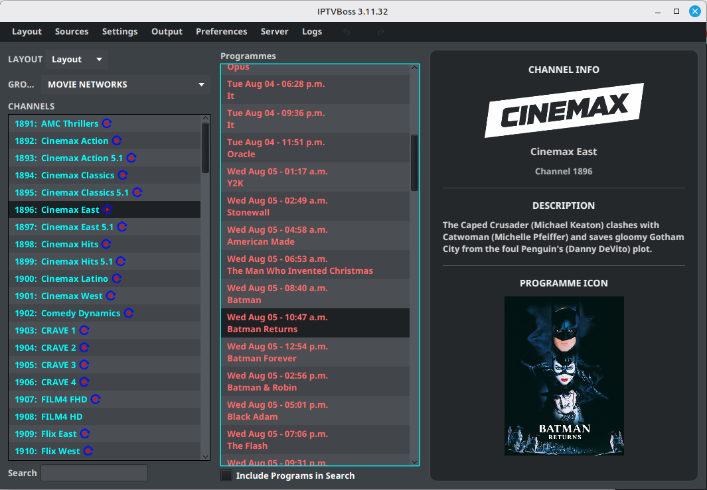

# Mapping Channels

Map a playlist channel to an EPG channel so the generated guide contains programme information.

## Open the layout editor

1. Open **Layout Manager**.
2. Select the layout that contains the imported playlist channels.
3. Open the layout in **Layout Editor**.
4. Select a channel that needs EPG data.

## Search for an EPG match

1. Select the EPG search or manual search control for the selected channel.
2. Review the suggested matches.
3. Select the EPG source and channel that match the playlist channel.
4. Review the channel name, identifier, and logo shown in the result.
5. Confirm the selection.
6. Save the layout.

Use the channel’s country, network, and service name to distinguish similarly named results. Do not select a match only because its display name looks similar.

## Review missing mappings

1. Return to the channel list in **Layout Editor**.
2. Use the missing-EPG indicator or search options to find channels without a match.
3. Repeat the search with a shorter or alternate channel name.
4. Leave the channel unmapped when no reliable match exists.

!!! warning
    An incorrect EPG match is worse than a missing match because it displays unrelated programme information.

## Confirm the mapping

The mapping is ready when the selected channel shows its EPG source and channel identifier and the layout can be saved without an error.

!!! note "Basic and Pro"
    Automatic mapping and built-in EPG tools may require Pro. Manual assignment remains the appropriate fallback when automatic tools are unavailable.
