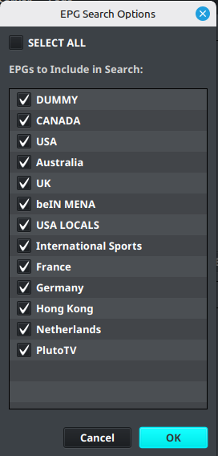

# Adding an EPG Source

An EPG source supplies programme information that can be assigned to channels in a layout.

## Add an external EPG source

1. Open **Sources**.
2. Select **Add EPG**.
3. Enter a descriptive name.
4. Enter the EPG source URL supplied by your provider.
5. Review any refresh, time-zone, and logo options shown in the dialog.
6. Select **Save**.

!!! warning
    Do not publish private EPG URLs, account tokens, or provider credentials.

## Synchronize the EPG source

1. Open [Source and EPG Tools](source-tools.md) → **Sources Manager**.
2. Select the EPG source.
3. Start the synchronization action.
4. Wait for the import to finish.
5. Confirm that the source contains channels before attempting channel mapping.

## Use built-in EPG data

[Pro users](../settings/pro.md) may have access to built-in EPG sources and the [EPG Browser](epg-browser.md). If the feature is locked, use an external EPG source or confirm the account’s Pro status.

!!! note "Basic and Pro"
    Basic accounts have a limited number of external EPG sources. Built-in EPG and advanced EPG tools may require Pro.

## Verify the source

The source is ready for mapping when synchronization completes and the expected channel names are available in the layout editor’s EPG controls.
