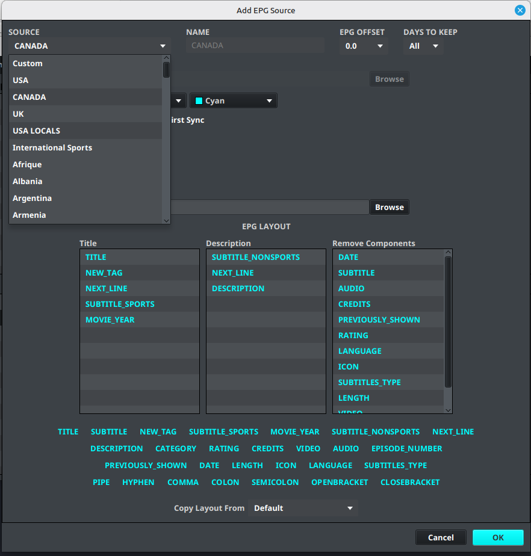
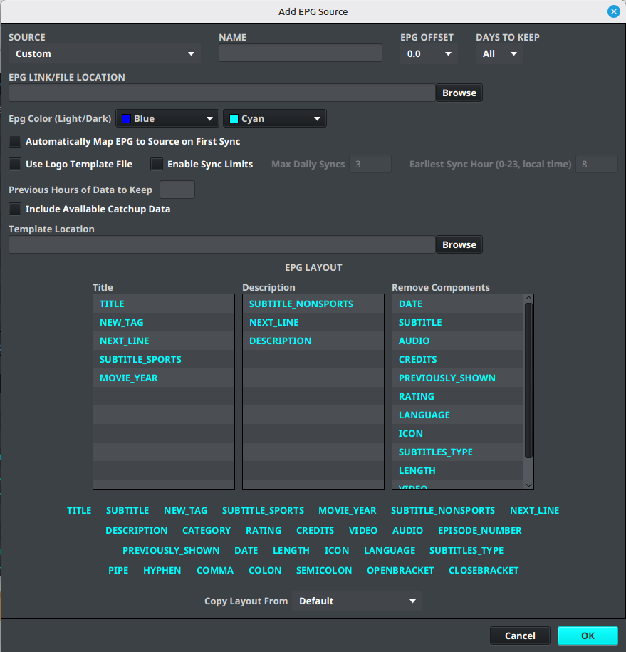

# Adding an EPG Source

An EPG source supplies programme information that can be assigned to channels in a layout.

## 💲 Add a built-in or Pro EPG

1. Open **Sources**.
2. Select **Add EPG**.
3. Open the **Source** dropdown.
4. Select the available built-in or Pro EPG source.
5. Confirm that the source name is populated and that the URL field is not required.
6. Review any refresh, time-zone, and logo options shown in the dialog.
7. Select **Save**.

The built-in source is then available for synchronization and channel mapping like another EPG source. If the source is not listed or is locked, confirm the account status in [Free vs Pro](../getting-started/free-vs-pro.md) and [IPTVBoss Pro Account Access](../settings/pro.md).

## Add an external EPG source

1. Open **Sources**.
2. Select **Add EPG**.
3. Leave **Source** set to **Custom**.
4. Enter a descriptive name.
5. Enter the EPG source URL supplied by your provider.
6. Review any refresh, time-zone, and logo options shown in the dialog.
7. Select **Save**.

!!! warning
    Do not publish private EPG URLs, account tokens, or provider credentials.

## Configure the EPG Layout

The **EPG Layout** section controls how imported programme components are combined when IPTVBoss writes the output guide. It is available while adding or editing an EPG source.

The editor contains three list views:

- **Title** — components used to create the programme title.
- **Description** — components included in the programme description.
- **Remove Components** — original components removed from the output XML after the title and description are created.

The available components are displayed above the lists. Drag a component into the required list and drop it in the order you want it to appear. For example, place **Title**, **Subtitle**, and **Movie Year** in the Title list, and place **Description** and **Category** in the Description list. Use **Next Line** or punctuation components when the output needs separators or line breaks.

To remove a component from one of the three lists, select it and right-click it. The component is removed from that list; it is not deleted from the source data. Components placed in **Remove Components** are omitted from the generated XML output, which can reduce duplicate or unwanted metadata.

!!! note
    Selecting a source from the **Copy Layout** dropdown loads that source's existing Title, Description, and Remove Components arrangement as a starting point. Review the copied layout before saving.

Save the EPG source after reviewing the three lists, then synchronize the source and inspect the generated guide output.

## Synchronize the EPG source

1. Open [Sources Manager](sources-manager.md).
2. Select the EPG source.
3. Start the synchronization action.
4. Wait for the import to finish.
5. Confirm that the source contains channels before attempting channel mapping.

## Use EPG data for mapping

After synchronizing an external or built-in source, use [Channel Mapping](channel-mapping.md) to assign its channels to playlist channels. After a mapping is saved, use the [EPG Browser](epg-browser.md) to inspect the programme data returned for that mapped channel.

!!! note "Basic and Pro"
    💲 Built-in EPG sources and some advanced EPG tools may require Pro. External EPG sources remain available when the account can use them. See [Free vs Pro](../getting-started/free-vs-pro.md).

## Verify the source

The source is ready for mapping when synchronization completes and the expected channel names are available in the layout editor’s EPG controls.
