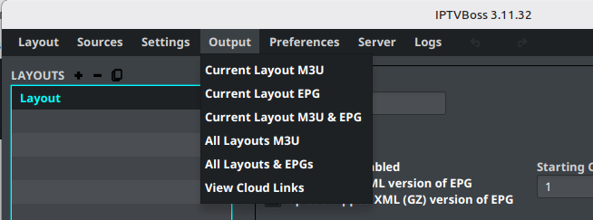

# Creating Output

After sources and layouts are configured, generate the playlist and guide files that your player or hosting provider will use.

## Prepare the layout

Before generating output:

1. Open **Layout Manager**.
2. Select the intended layout.
3. Confirm that the layout is enabled.
4. Confirm that the required channels and EPG mappings are saved.
5. Confirm the output folder or cloud-provider settings.

## Generate output for the current layout

Open the **Output** menu and choose the output type you need:

- **Current Layout M3U** generates the playlist for the selected layout.
- **Current Layout EPG** generates the guide data for the selected layout.
- **Current Layout M3U & EPG** generates both outputs together.

Wait for the output operation to finish before opening the files or copying links into a player.

## Generate output for all layouts

Use the all-layout options when you intentionally want to process every enabled layout:

- **All Layouts M3Us** generates playlists for all layouts.
- **All Layouts M3Us & EPGs** generates playlists and guide data for all layouts.

Do not use an all-layout action when you are testing a single layout change.

## Review output

1. Open the configured output folder or cloud-provider destination.
2. Confirm that the expected M3U and/or EPG file exists.
3. Open the file only if doing so does not expose private URLs or credentials.
4. Test the output in your intended player.
5. If the player shows no guide data, return to [Mapping Channels](channel-mapping.md) and verify the EPG assignments.

!!! note
    Output filenames and destinations depend on the layout settings. Do not assume that every layout writes to the same folder.

!!! note "Version requirement"
    These menu names target the IPTVBoss 3.11 desktop workflow.
