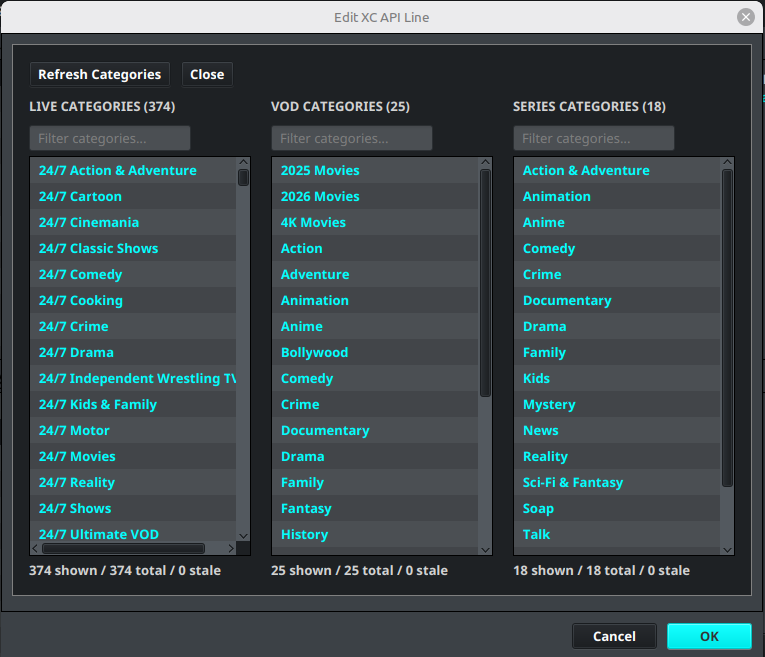

# Playlist Categories

Playlist category settings control which Live, VOD, and Series categories IPTVBoss imports from an M3U or Xtream Codes source. A new source must load its categories before it can be saved.

## Load and select categories

1. Select **Manage Categories** while adding or editing a playlist source.
2. Select **Refresh Categories**.
3. Wait for the provider's current categories to load.
4. Select a category. Use Ctrl-click on Windows/Linux or Command-click on macOS to select multiple categories.
5. Right-click the selection and choose the required action.
6. Repeat the selection independently for Live, VOD, and Series.
7. Close the category view to keep the selection, then save the source.

## Understand the category lists

The dialog contains separate lists for **Live Categories**, **VOD Categories**, and **Series Categories**. The count below each list reports how many categories are shown, how many exist in total, and how many are stale. Use the filter above a list to narrow the visible categories.

The right-click actions include:

- **Select All** selects every category in the current list.
- **Enable Selected** includes the selected categories in the source.
- **Disable Selected** excludes the selected categories from the source.
- **Clear Selected Stale** removes selected categories that are no longer current, when stale categories are present.

For a first setup, enable a small set of Live categories. Add VOD or Series only when you intend to include that content and understand the related output settings.

## Maintain an existing source

Refresh the categories after the provider adds, removes, or renames content. After changing the enabled categories:

1. Save and synchronize the source.
2. Review the imported channel totals in **Sources Manager**.
3. Confirm that affected layouts still contain the intended groups and channels.
4. Review [New Category Manager](../layouts/new-category-manager.md) when newly discovered provider categories should be added to a layout automatically.

Playlist category selection controls what the source downloads. **New Category Manager** is a separate layout-level rule and does not enable or disable source categories.
