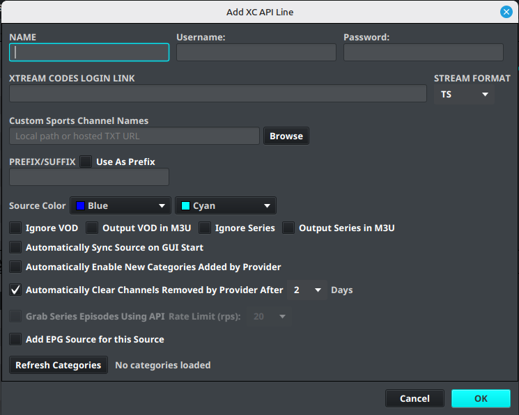

# Adding a Playlist

IPTVBoss can import an M3U playlist from a URL or local file. It can also import a provider connection through the API source workflow.

!!! note "Required before saving"
    A new playlist source must go through **Manage Categories** before it can be saved. Use **Refresh Categories** inside that view to load the provider's current categories.

!!! warning
    Use only playlist sources that you are authorized to access. Treat provider URLs, usernames, and passwords as private credentials.

## Add an M3U source

1. Open **Sources**.
2. Select **Add M3U Source**.
3. Enter a descriptive value in **Name**.
4. Enter the playlist address in **Source Link**, or select **Browse** to choose a local `.m3u` file.
5. If the source requires authentication, enable the username/password option and enter the provider credentials.
6. Select **Manage Categories** before saving the source.
7. In the category view, select **Refresh Categories** and wait for IPTVBoss to load the provider's current categories.
8. Select the categories you want to import, then close the category view.
9. Review the output and category options.
10. Select **Save**.

## Add an API source

Use the API workflow when your provider supplies a server address, username, and password instead of a complete M3U URL.

1. Open **Sources**.
2. Select **Add API Source**.
3. Enter the provider server address.
4. Enter the supplied username and password.
5. Select **Manage Categories** before saving the source.
6. In the category view, select **Refresh Categories** and wait for the category list to load.
7. Select the categories and content types to include.
8. Review whether VOD or series content should be included in the M3U output.
9. Select **Save**.

!!! note
    API source fields vary by provider. If the provider gives you a complete playlist URL, use **Add M3U Source** instead.

## Synchronize the source

1. Open **Sources** → **Sources Manager**.
2. Select the source you added.
3. Start the source synchronization action.
4. Wait for the synchronization to finish before editing channels or generating output.
5. Review the imported categories and channel count.

If synchronization fails, confirm that the URL is reachable, credentials are correct, and the provider is online. Then review [Common Problems](../troubleshooting/common-problems.md).

!!! note "Basic and Pro"
    Basic accounts have a limited number of playlist sources. Pro accounts provide higher or unlimited source limits depending on the subscription tier.

!!! note
    Menu labels and screenshots may change between desktop releases.
