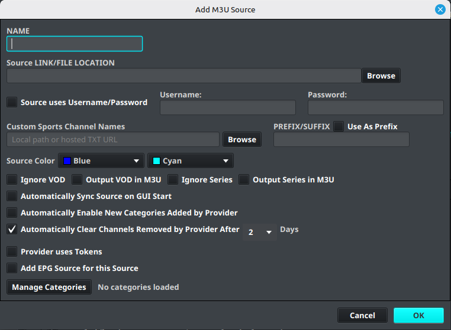
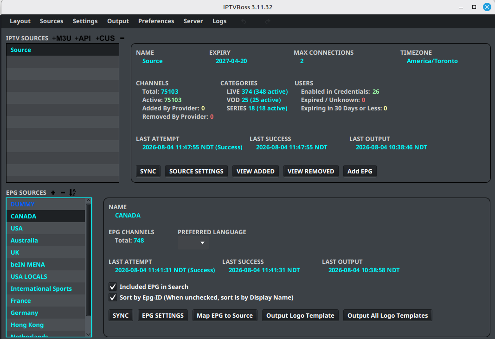

# Adding a Playlist

This page explains how to add and synchronize an M3U or API playlist source in IPTVBoss.

## Add an M3U playlist

1. Open IPTVBoss.
2. Select **Sources**.
3. Select **Add M3U**.
4. Enter a descriptive source name.
5. Enter the playlist URL or select the appropriate local file option.
6. Review the source settings.
7. Select **Save**.
8. Synchronize the source from the Sources Manager.

!!! note
    Do not include playlist credentials or private URLs in screenshots, support tickets, or documentation examples.

## Confirm the source

Open **Sources** → **Sources Manager** and confirm that the playlist appears with its current synchronization status.

!!! note "Version requirement"
    These labels and screenshots target the IPTVBoss 3.11.x desktop workflow and may change in later releases.

