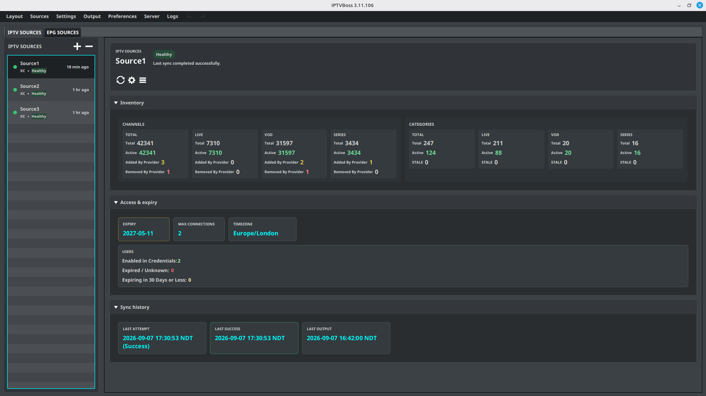

# Adding Playlists

IPTVBoss can import a genuine M3U playlist from a URL or local file, or connect to a provider using an Xtream Codes source.

!!! warning
    Use only playlist sources that you are authorized to access. Treat provider URLs, usernames, and passwords as private credentials.

## What are you adding?

Use the source type that matches the information supplied by the provider:

| Choose | When to use it |
| --- | --- |
| **M3U source** | You have a complete playlist URL or a local `.m3u` file. |
| **Xtream Codes source** | You have a server address, username, and password, or a URL containing `get.php?username=...&password=...`. |

Both workflows require you to refresh and select provider categories before saving. If the source fields are valid but no categories have been loaded yet, IPTVBoss opens the category manager when you select **Save** so you can complete that step. See [Playlist Categories](playlist-categories.md) for every category action.

When you add a new playlist source in the desktop GUI, IPTVBoss starts its first source synchronization after the source is saved. When you edit an existing source, IPTVBoss saves the settings first and asks **Sync now?** only when the changes affect source synchronization, such as the provider connection, included categories, or content-processing options. Select **No** to keep the saved settings without synchronizing yet. See [Sources Manager](sources-manager.md#sync-on-start) for startup synchronization and cancellation.

## Add an M3U source

1. Open **Sources**.
2. Select **Add M3U Source**.
3. Enter a descriptive value in **Name**.
4. Enter the playlist address in **Source Link**, or select **Browse** to choose a local `.m3u` file.
5. If the source requires authentication, enable the username/password option and enter the provider credentials.
6. Select **Manage Categories** before saving the source. If you skip this step, selecting **Save** with valid source fields and no loaded categories opens the category manager automatically.
7. In the category view, select **Refresh Categories** and wait for IPTVBoss to load the provider's current categories.
8. Select the categories you want to import, then close the category view.
9. Review the output and category options.
10. Select **Save**. The first source synchronization starts after the source is saved.

## Add an Xtream Codes source

Use the Xtream Codes workflow when your provider supplies a standard login connection. This is the recommended choice for a link such as:

`http://provider.example:8080/get.php?username=myuser&password=mypass&type=m3u_plus&output=ts`

Do not paste the entire `get.php` link into the connection dialog. Extract these three fields:

- **Address**: `http://provider.example:8080/` — keep the scheme, hostname, and port; remove `/get.php` and everything after the `?`.
- **Username**: the value after `username=` — `myuser` in the example.
- **Password**: the value after `password=` — `mypass` in the example.

If a value contains URL-encoded characters such as `%2B` or `%40`, copy the value exactly as provided rather than changing it. If the provider gives you a standard Xtream Codes link with a different filename or additional query parameters, the same rule applies: use the server portion as the address and copy the `username` and `password` parameter values.

1. Open **Sources**.
2. Select **Add XC Source**.
3. Enter the provider server address.
4. Enter the supplied username and password.
5. Select **Manage Categories** before saving the source. If you skip this step, selecting **Save** with valid source fields and no loaded categories opens the category manager automatically.
6. In the category view, select **Refresh Categories** and wait for the category list to load.
7. Select the categories and content types to include.
8. Review whether VOD or series content should be included in the M3U output.
9. Select **Save**. The first source synchronization starts after the source is saved.

!!! note
    Use **Add M3U Source** for a genuine M3U playlist URL or local `.m3u` file that is not a standard Xtream Codes login link. When the URL follows the `get.php?username=...&password=...` pattern, use **Add XC Source** so IPTVBoss can retrieve the provider's Live, VOD, and Series categories through the Xtream Codes connection.

## Disable automatic NoGUI user checks for a source

Both M3U and Xtream Codes source editors include **Disable NoGUI user checks**. Enable it when NoGUI synchronization should skip automatic provider credential and expiry refreshes for that source. This is stored per source and does not disable playlist synchronization or manual credential refreshes.

Automatic NoGUI checks apply to enabled, at-risk user credentials for Xtream Codes sources and password-backed M3U sources that have an XC URL. Each credential is checked at most once every 24 hours for the same connection details. See [External noGUI Scheduling](../settings/automation.md#automatic-nogui-user-checks) for the scheduling behavior and eligibility rules.

Leave the option disabled when expiry and credential metadata should be refreshed automatically. A source-level opt-out is useful for providers that do not support these account-information requests or that impose strict request limits.

## Synchronize the source

1. Open **Sources** → **Sources Manager**, then open the **IPTV Sources** tab.
2. Select the source you added.
3. Select { .ui-icon } **Sync** in the source action bar.
4. Wait for the synchronization to finish before editing channels or generating output. Select **Cancel** in the progress view to request cancellation; the current network or processing step may finish first.
5. Review the imported categories and channel count.

If synchronization fails, confirm that the URL is reachable, credentials are correct, and the provider is online. Then review [Common Problems](../troubleshooting/common-problems.md).

If you cancel a synchronization, the source is marked **Sync cancelled** in Sources Manager. Run **Sync** again after confirming the source settings.

!!! note "Free and Pro"
    Source limits are listed only in the canonical [Free vs Pro comparison](../getting-started/free-vs-pro.md). If you reach the current limit, remove an unused source or review the available Pro plans.

!!! note
    Menu labels and screenshots may change between desktop releases.
