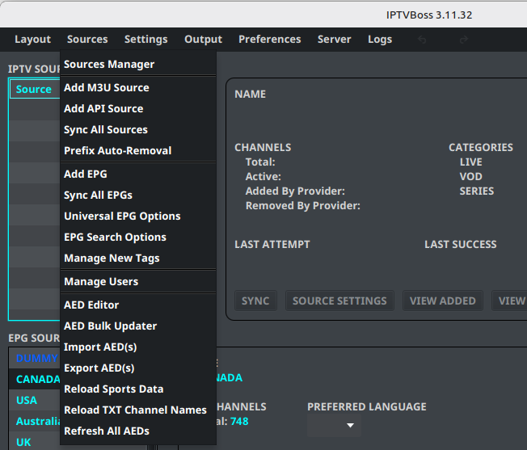
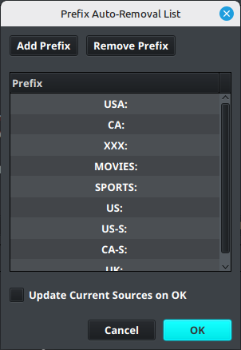
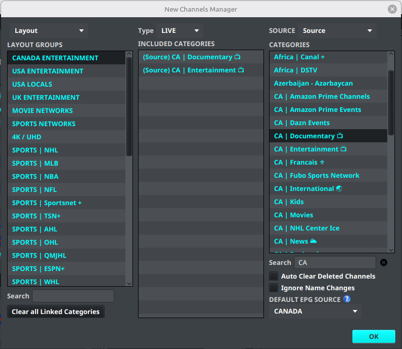
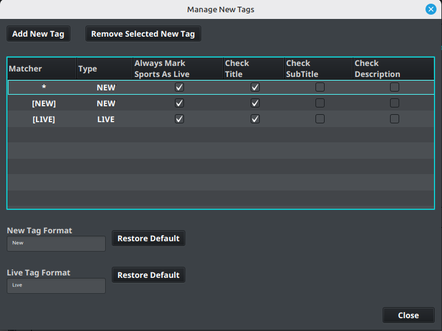

# Source and EPG Tools

The **Sources** menu contains maintenance tools for imported channels, categories, EPG data, users, tags, and Advanced EPG Dummies.

## Sources Manager

Use **Sources** → **Sources Manager** to review imported playlist and EPG sources, start synchronization, and inspect source status.

Use **Sync All Sources** when all configured playlist sources should be refreshed. For a controlled test, synchronize one selected source from **Sources Manager** instead.

## Remove provider prefixes

**Prefix Auto-Removal** can help normalize provider channel names before mapping and sorting.

1. Open **Sources** → **Prefix Auto-Removal**.
2. Review the detected or configured prefixes.
3. Select only prefixes that should be removed from the imported names.
4. Apply the change.
5. Recheck channel mappings and output names.

!!! warning
    Name cleanup can affect matching, AED regexes, and output. Record the original naming pattern before applying a broad change.

## Manage categories

Use **Manage Categories** in the source dialog before saving a new playlist. The same view can be opened later when category membership or category names have changed at the provider.

1. Open **Manage Categories** from the source workflow.
2. Select **Refresh Categories** in the category view.
3. Wait for the provider's current categories to load.
4. Select the categories to use and review the proposed changes.
5. Close the category view to keep the selection.
6. Confirm that the affected layout groups still contain the intended channels.

## Manage channels and categories

The layout tools can create or manage channels and categories when the imported provider data does not match the desired organization.

- Use **New Channel Manager** to create or maintain channel entries.
- Use **New Category Manager** to create or maintain category entries.

Review the resulting layout and output after making manual entries. Do not create duplicates when an existing source channel can be mapped instead.

## Manage new tags

Use **Sources** → **Manage New Tags** to review tags discovered during source or EPG processing.

Confirm the tag behavior before applying it globally. Tags can affect grouping, filtering, or output depending on the configuration.

## EPG search options

Use **Sources** → **EPG Search Options** to adjust the matching behavior used when searching for EPG channels. Test a changed option against a small set of channels before remapping a complete layout.

## Manage users

Use **Sources** → **Manage Users** to create users, enable or disable them, assign enabled layouts, and configure source credentials. See [User Management](../layouts/users.md) for the provider and multi-user workflow.
