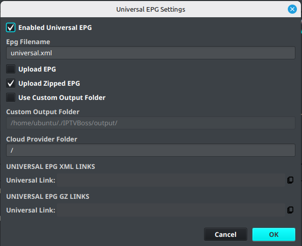

# Universal EPG

💲 [Pro feature — see Free vs Pro](../getting-started/free-vs-pro.md).

Universal EPG creates one shared guide output that can be reused by multiple users, layouts, or players when they use the same guide data.

Using one shared EPG can reduce duplicate output files and simplify player configuration. It is not appropriate when different users require different guide selections or mappings.

## Configure Universal EPG

1. Open **Sources**.
2. Select **Universal EPG Options**.
3. Choose the EPG sources and output options required by your guide.
4. Review the selected channels and mappings.
5. Save the configuration.
6. Run **Sources** → **Sync All EPGs**.
7. Generate the required output and verify the resulting guide file.

## Use Universal EPG with multiple users

1. Configure and verify the shared EPG first.
2. Assign the same EPG output to the users or layouts that should share it.
3. Generate output for the layouts.
4. Test the shared guide link in a player.

If users need different channel selections, time-zone behavior, or EPG mappings, create separate layout-specific EPG output instead.
