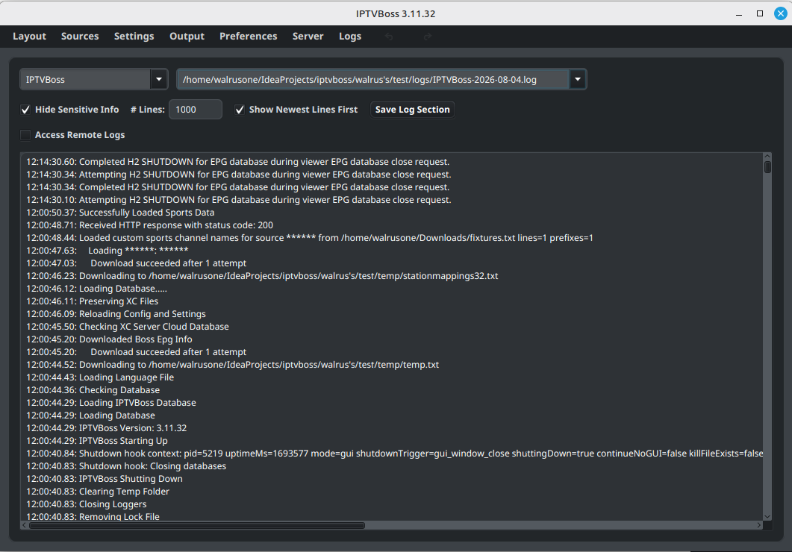
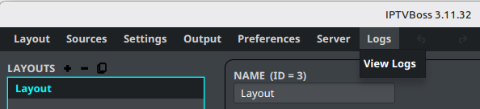

# Logs and Diagnostics

Logs record startup, source synchronization, EPG imports, output generation, and errors. Include the relevant log with a support request when it does not contain private information.

## View logs in IPTVBoss

1. Open **Logs**.
2. Select **View Logs**.
3. Choose the log type.
4. Select the date or log file that covers the failed operation.
5. Review the entries around the time of the failure.





## Find the log files

IPTVBoss stores logs in a `logs` directory under its application data directory. The application’s log viewer is the safest way to identify the active data location.

Log files use the logger name and date, for example:

```text
IPTVBoss-YYYY-MM-DD.log
```

Additional log types may be present for EPG or advanced editing operations.

## Collect useful diagnostics

Record:

- IPTVBoss version
- Operating system and processor architecture
- The action that failed
- The approximate time of the failure
- The source, EPG source, layout, or output involved
- The relevant log entries
- Whether the problem occurs after restarting IPTVBoss

!!! warning
    Inspect logs before sharing them. Remove credentials, private URLs, tokens, license keys, email addresses, and customer information.

## Change log detail

If support asks for more detail, review the log-level and time-zone settings in **Settings**. Change diagnostic settings only as requested, and restore normal settings after collecting the evidence.
