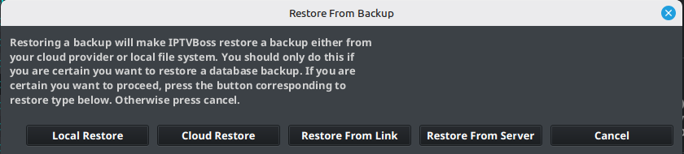

# Resetting IPTVBoss

Resetting IPTVBoss can remove local configuration, sources, layouts, or database content. Use restore or support procedures before deleting application data.

## Prefer restore over deletion

If the database is damaged or the configuration is wrong, first identify a known-good backup. IPTVBoss supports restore sources that may include:

- A local backup
- A cloud backup
- A backup link
- An IPTVBoss server backup

## Restore a known-good backup

1. Close operations that write to the database.
2. Confirm that the backup belongs to the intended database.
3. Open the database restore action.
4. Choose the appropriate restore source.
5. Read the confirmation message carefully.
6. Continue only when you understand which current data will be replaced.
7. Allow IPTVBoss to finish the restore and reload process.
8. Confirm that sources, layouts, and settings are present.

!!! warning
    A restore can replace current data. Preserve a copy of the current database before proceeding if it can still be accessed.

## Reset only after review

Do not manually delete the application data directory unless support has provided exact instructions for your operating system and version. A manual deletion can remove the only usable copy of your database.

If no backup is available, collect the logs and open a support ticket before resetting anything.
